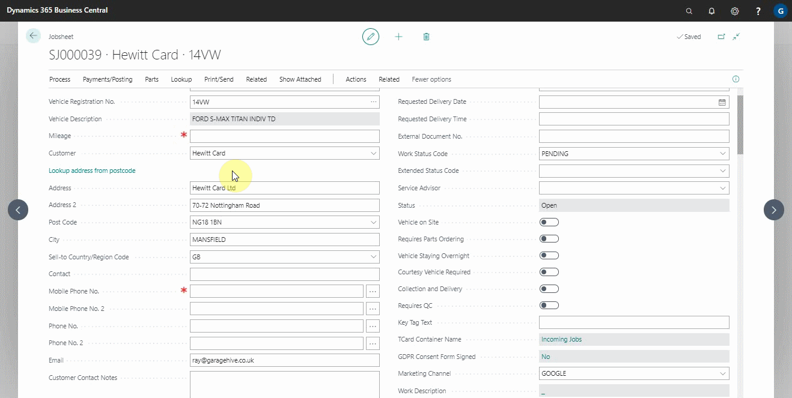
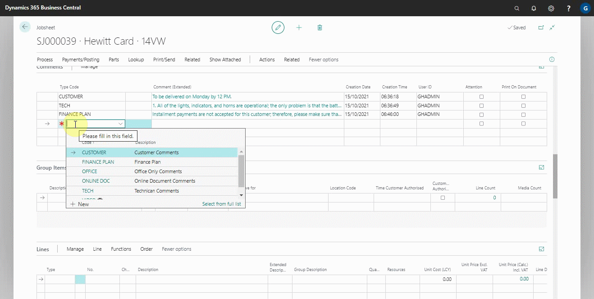
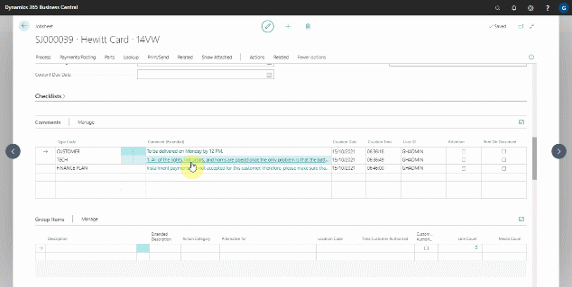

# How to Use Comments (Extended)

Comments (Extended) is a function in Garage Hive that enables the you to write comments which are longer and with more details. This function is available on all documents, can be printed in documents and has the possibility of hiding from the technicians.

Clicking on the comment extended cell will open a pop-out window that can be made full screen and allows you to type as much text as you want. If you scroll your cursor over the Comments (Extended) cell, you will see a pop-up preview for the comment. 

To add a new comment, you must first choose a type code or create your own custom type code with the specific set-up that you need. The set-up entails specifying the following:
* **Description** - Specifies what will be printed on the invoice.
* **Office Only** - Indicates whether the comment should be hidden from technicians.
* **Print On Invoice** - Indicates whether the comment should be printed for the customer to see.
* **Print Sequence** - This parameter specifies the order in which the comments are printed. Numbers are used to specify priority in ordering; the lower the number, the higher the priority in ordering, and vice versa.
* **Print Placement** - Specifies whether the comment appears at the top or bottom of the invoice.

You can also have standard comments that can be used multiple times. This helps to ensure consistency and makes it easier to remember what to write. Here's how to create a standard comment:
1. Search for **Service Comments Types** in the top-right corner's search icon and select it from the results.

   

2. In the window that appears, select the comment **Type Code** to which you want to add a standard comment and click on the cell under **Comment (extended)**.
3. Enter the standard comment and click OK.

   

4. The comment will now be available for adding in all documents, such as a jobsheet.

 

Here's an example of what printed comments look like; you can be as creative as you want with the description, positions, and orders. 

 

Comments on a phone now include additional information such as the time, date, user, and type code.

 

Before writing a comment, technicians must choose a type code.

 

When reading or entering comments on a phone, the comment is now displayed in a pop-up window. Once you've finished typing your comment, click OK. 

### See Also

[Video: How to use comments on service documents in Garage Hive](https://www.youtube.com/watch?v=ebt1UsiP28k&:target="_blank") \
