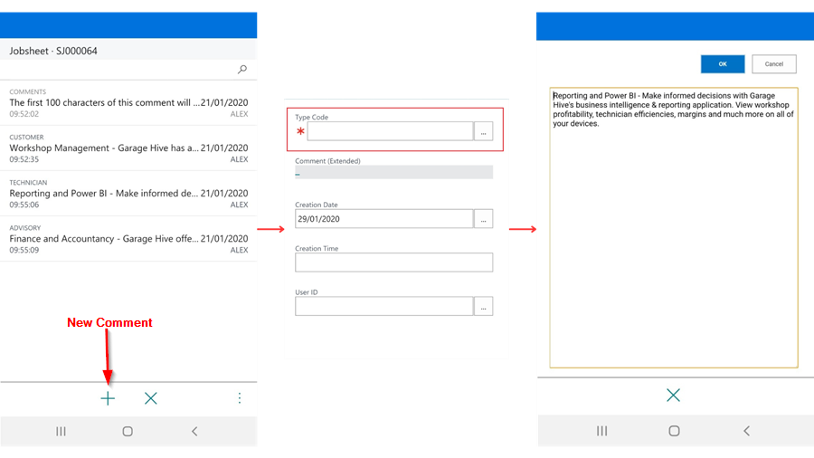
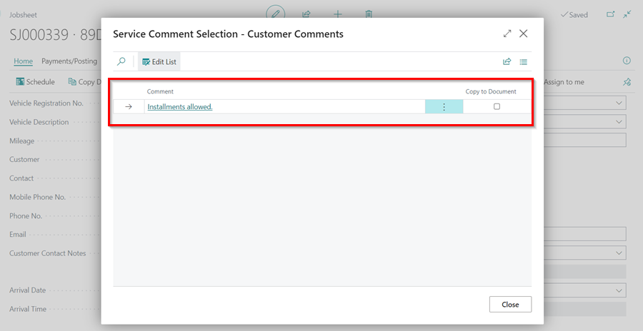
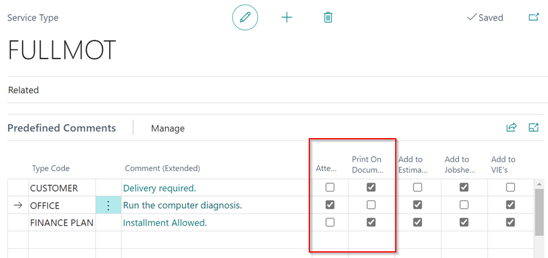
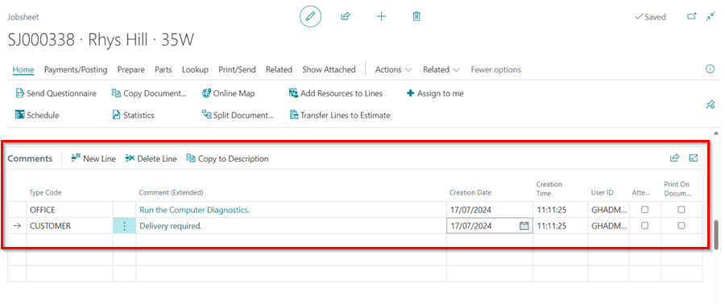

# In this article
1. [Adding Comments in a Document](#adding-comments-in-a-document)
2. [How to Use Extended Comments](#how-to-use-extended-comments)
3. [Creating Standard Comments](#creating-standard-comments)
4. [Adding Comments in a Card](#adding-comments-in-a-card)
5. [Adding Predefined Comments](#adding-predefined-comments)

### Adding Comments in a Document
To add a new comment in a document:
1. Open the document and scroll down to the **Comments** subpage.

   

2. Select a **Type Code** or create your own custom **Type Code** with the following set-up:
   * **Description** - Specifies what will be printed on the invoice.
   * **Office Only** - Indicates whether the comment should be hidden from technicians.
   * **Print On Document** - Indicates whether the comment should be printed for the customer to see.
   * **Print Sequence** - This parameter specifies the order in which the comments are printed. Numbers are used to specify priority in ordering; the lower the number, the higher the priority in ordering, and vice versa.
   * **Print Placement** - Specifies whether the comment appears at the top or bottom of the invoice.

      

3. You can now add a comment to the document, by selecting the **Type Code** and adding the comment in the **Comment** field.
4. Here's an example of what printed comments look like; you can be as creative as you want with the description, positions, and orders. 

   

5. Comments on a phone now include additional information such as the time, date, user, and type code.

   

6. Before writing a comment, technicians must choose a type code.

   

7. When reading or entering comments on a phone, the comment is now displayed in a pop-up window. Once you've finished typing your comment, click OK. 

   

[Go back to top](#top)

### How to Use Extended Comments
**Comment (Extended)** is a function in Garage Hive that enables you to write comments which are longer and with more details. This function is available on all documents, can be printed in documents and has the possibility of hiding from the technicians.

1. Under the **Comments** subpage, click on the **Comment(extended)** field 

   

2. This opens a pop-out window that can be made full screen and allows you to type as much text as you want. 

   

3. When you move your cursor over the **Comment (extended)** field, a pop-up preview of the full comment appears. 

   

[Go back to top](#top)

### Creating Standard Comments
You can also have standard comments that can be used multiple times. This helps to ensure consistency and makes it easier to remember what to write. Here's how to create a standard comment:
1. In the top-right corner, choose the  icon, enter **Service Comments Types**, and select the related link.

   

2. In the window that appears, select the comment **Type Code** to which you want to add a standard comment and click on the field **Comment (extended)**.
3. Enter the standard comment and click OK.

   

4. The comment will now be available for adding in all documents, such as a jobsheet.

   

[Go back to top](#top)

### Adding Comments in a Card
To add a new comment in a card, for example a **Customer Card**:
1. Open the **Customer Card**, then select **Customer** and then **Comments** from the menu bar.

   

2. Add the comment and then close the card.

   

3. When adding the customer to a new Jobsheet, the comment(s) will now pop up before adding the customer, giving you the option to use the **Copy to Document** action to transfer the comment to the document.

   

[Go back to top](#top)

### Adding Predefined Comments
**Predefined Comments** can be added using **Service Types** or **Service Packages**, which means that when a Service Type or a Service Package is added to the Jobsheet, Estimate or VIE, the predefined comments are automatically added in the **Comments** sub-page. To add predefined comments:
1. Search for **Service Types** in the top right corner  icon, and select the related link.

   

2. Select the Service Type for which you want predefined comment(s), then scroll down to the **Predefined Comments** sub-page, select the comment **Type Code**, and enter the comment in the **Comment(Extended)** column.
3. Select the checkboxes on the right to have the comment added to **Jobsheets**, **Estimates**, or **VIEs**. At least one document, if not all, should be selected.

   

4. Select the checkbox in the **Print on Document** or **Attention** column if you want it printed on the document or marked as **Attention**.

   

5. When finished, close the page.
6. Similarly, to add the predefined comment(s) in **Service Packages**, go to the **Catalogues** menu on the home screen and select **Service Packages**.

   

7. Select the **Service Package** for which you want to add predefined comment(s), then scroll down to the **Predefined Comments** sub-page, select the comment **Type Code**, and enter the comment in the **Comment (Extended)** column.

   

8. When a **Service Type** or **Service Package** with a predefined comment is added to the Jobsheet, Estimate or a VIE, the comment(s) are automatically added to the **Comments** subpage.

   

[Go back to top](#top)

 

### See Also

[Video: How to use comments on service documents in Garage Hive](https://www.youtube.com/watch?v=ebt1UsiP28k){:target="_blank"}
