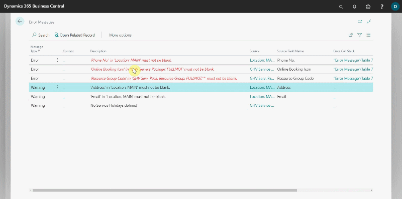

# Common Errors for Online Booking 

To begin, read these [articles](garagehive-onlinebooking-intro.html) to learn how to set up **Online Booking** (Click **Next step** at the end of each article).

The **Online Booking Setup** page in Garage Hive has the **Test Catalog Setup** action, which you can use to view any setup errors.



When you select the **Test Catalog Setup** action, the errors in the setup are displayed. Select one error at a time and click **Open Related Record** to go to the page where the error is.

In this article, we'll look at the common errors and how to fix them:
1. **Online Booking Priority** must not be blank: This error occurs when the order in which the service packages appear online is not added, and it is located in the **Service Package** card under the **Online Booking** FastTab. Enter a number in the field **Online Booking Priority**; the lower the number the higher it will appear in the order.

   

2. **No Branches** are published to online booking: This error occurs when the **Branch** is not added and published in online booking. **Open Related Record** to go to the **Branch List** for the online booking setup. Add a branch (if not added yet) and then enable the **Publish Online Booking** checkbox.

   

3. **Service Package has no Resource Groups**: This error occurs when the **Resource Group** is not specified; resource group is used to determine the possibility of booking a service package based on the availability of the resources in the resource group. **Open Related Record** to go to the **Service Package** card, from the actions bar select **Related**, **Package** and then **Resource Groups.** Select the **Location Code** and then the **Resource Group Code.**

   

4. **Online Booking Icon** must not be blank: This error occurs when the **Online Booking Icon** is not selected; this is the icon to be displayed for the service package in the online widget. **Open Related Record** to go to the **Service Package** card, scroll down to **Online Booking(OB)** FastTab. Select an icon by clicking on the three dots in the **Online Booking Icon** field; you can preview the icon by clicking on the three dots at the end of the field.

   
   
5. **Resource has no Time Grids**: This error occurs when the resource for the online booking don't have time grids slots; this are the system time allocations that help manage resource time slots availability for online bookings. **Open Related Record** to go to the **Resource** card, from the actions bar select **Related**, **Resources** and then **Time Grids**. In the **Resource Time Grids** table, add the different slots that the resource is available for online booking, could be **45MIN**, **1HR** and **2HRS**.

   

