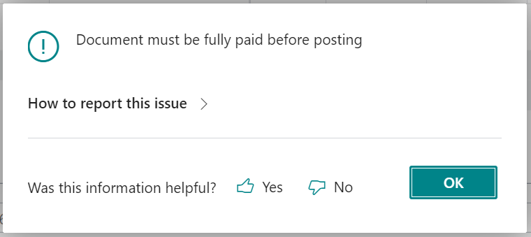
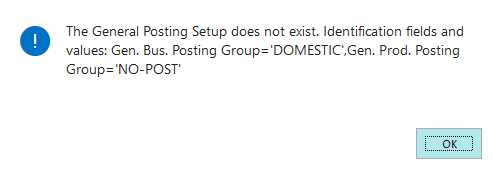
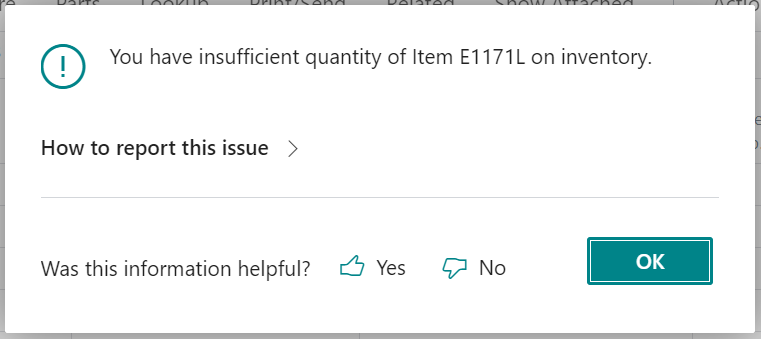
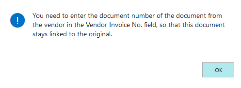
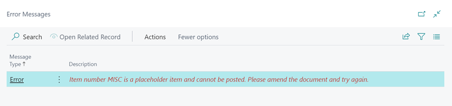
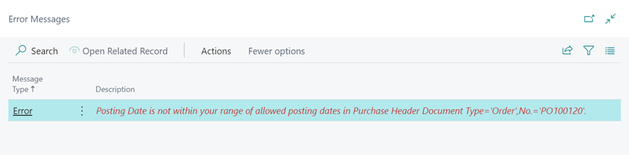

# Common Errors and Solutions When using the Garage Hive System
In order to effectively use the Garage Hive system, it is important to familiarise yourself with the various procedures and steps required to complete specific tasks. Despite this, it is not uncommon for users to encounter alerts or warnings during the initial stages of using the software. These alerts may indicate that a task has not been properly executed or that there is an issue with the system that needs to be addressed. In this article, we will provide an overview of some of the most common errors and issues that users may encounter while using Garage Hive, as well as provide solutions for addressing and resolving these problems.

## In this article
1. [Jobsheet Common Errors](#jobsheet-common-errors)
2. [Purchase Order Common Errors](#purchase-order-common-errors)

### Jobsheet Common Errors
1. **Error** - 'Document must be fully paid before posting!'
   
      

   > This error indicates that the document is not yet paid, or it doesn't have payment terms.
      
|                |                                                                                   |
| :------------- | :-------------------------------------------------------------------------------- |
| **Solution 1** | **Take Payment.**                                                                 |
|                | - Select Payment/Posting in the menu bar, followed by Take Payment.               |
|                | - Enter the payment for the job done in the Payment Method line, and click Close. |
|                | - You can now proceed and Post the document.                                      |
|                |                                                                                   |
| **Solution 2** | **Add Payment Terms Code.**                                                       |
|                | - In the document, scroll down to the Invoicing FastTab.                          |
|                | - Enter payment terms in the Payment Terms Code field.                            |
|                | - you can now proceed and Post the document.                                      |
|                |                                                                                   |

   **Learn More** - [Taking a Payment and Posting a Jobsheet](/docs/garagehive-jobsheet-taking-payment.html#taking-a-payment-in-a-jobsheet-and-posting-it){:target="_blank"}.

1. **Error** - 'Item No. MISC (Placeholder Item) on line 181000 is marked as Placeholder Item. Current item could not be used.'

      

   > This error indicates that the specified line in the document contains a Placeholder item that must be replaced with an item in stock before posting.

   |                |                                                                                                                                                  |
   | :------------- | :----------------------------------------------------------------------------------------------------------------------------------------------- |
   | **Solution 1** | **Order Item Through Purchase (Special).**                                                                                                       |
   |                | - If you haven't purchased the item, you can order it through Purchase (Special).                                                                |
   |                | - Scroll to the Lines FastTab and in the Jobsheet lines, tick box in the Purchase (Special) column, and add the Vendor in the Vendor No. Column. |
   |                | - Click on Parts from the menu bar, and select Create Purchase Order(s).                                                                         |
   |                | - This creates a Purchase Order for the item.                                                                                                    |
   |                | - After receiving the items, convert the item to stock item (see solution 2).                                                                    |
   |                |                                                                                                                                                  |
   | **Solution 2** | **Convert Item to Stock Item.**                                                                                                                  |
   |                | - After receiving the items from the vendor, click on Parts in the menu bar, and select Convert Placeholder Items.                               |
   |                | - Scroll to the left and click on the action, in the Action column. Click OK.                                                                    |
   |                |                                                                                                                                                  |

   **Learn More** - [Working with a Placeholder Item](/docs/garagehive-creating-a-placeholder-item.html){:target="_blank"}.

2. **Error** - 'You have insufficient quantity of Item E1171L on inventory.'

      

   > This error indicates that the selected item is not in stock, or more items than are in stock have been signed out in Jobsheets.

   |                |                                                                                                                         |
   | :------------- | :---------------------------------------------------------------------------------------------------------------------- |
   | **Solution 1** | **Check Items Signed Out in Jobsheet.**                                                                                 |
   |                | - If the Item is in stock, open the Item list from the Role Centre.                                                     |
   |                | - Compare the Inventory and Qty. on Jobsheet columns.                                                                   |
   |                | - If inventory column is lower, you need to remove the item in some Jobsheets, or purchase more items (see solution 2). |
   |                |                                                                                                                         |
   | **Solution 2** | **Create a Purchase Order for the Item.**                                                                               |
   |                | - If the item is unavailable in stock, in the document scroll to the left in the Jobsheet lines.                        |
   |                | - Tick the box in the Purchase (Special) column, and add the Vendor in the Vendor No. column.                           |
   |                | - Click on Parts from the menu bar, choose Create Purchase Orders (s).                                                  |
   |                | - This creates a Purchase Order for the item, and now you can order the item from the vendor.                           |
   |                |                                                                                                                         |

[Go back to top](#top)

### Purchase Order Common Errors
1. **Error** - 'You need to enter the document number of the document from the vendor in the Vendor Invoice No. field, so that this document stays linked to the original.'

      

   > This error indicates that the Vendor's Invoice No. is missing from the document.

   |              |                                                                                                                                                          |
   | :----------- | :------------------------------------------------------------------------------------------------------------------------------------------------------- |
   | **Solution** | **Add Vendor Invoice No.**                                                                                                                               |
   |              | - In the General FastTab of the Purchase Order, enter the Vendor Invoice No. field to match the number of the invoice you have received from the vendor. |
   |              | - Then click on Posting, and select Post.                                                                                                                |
   |              |                                                                                                                                                          |

   **Learn More** - [How to Create and Use Purchase Orders in Garage Hive](garagehive-create-a-purchase-order.html){:target="_blank"}.

2. **Error** - 'Item number MISC is a placeholder item and cannot be posted. Please amend the document and try again.'

      

   > This error indicates that the placeholder item (e.g. MISC) has not yet been updated to the actual stock item number.

   |              |                                                                                                   |
   | :----------- | :------------------------------------------------------------------------------------------------ |
   | **Solution** | **Convert the Placeholder Item to Stock Item.**                                                   |
   |              | - In the Purchase Order, click on Process from the menu bar, and choose Convert Placeholder Item. |
   |              | - Scroll to the left and click on the action, in the Action column. Click OK.                     |
   |              | - Then click on Posting, and select Post.                                                         |
   |              |                                                                                                   |

3. **Error** - 'Posting Date is not within your range of allowed posting dates in Purchase Header Document Type='Order',No.='PO100120''.

      

   > This error indicates that you are posting a Purchase Order with a past Posting Date.

   |              |                                                                                                      |
   | :----------- | :--------------------------------------------------------------------------------------------------- |
   | **Solution** | **Convert the Placeholder Item to Stock Item.**                                                      |
   |              | - In the General FastTab of the Purchase Order, update the Posting Date field to match today's date. |
   |              | - Also, ensure that the Document Date matches the Vendor Invoice date.                               |
   |              | - Then click on Posting, and select Post.                                                            |
   |              |                                                                                                      |

[Go back to top](#top)
