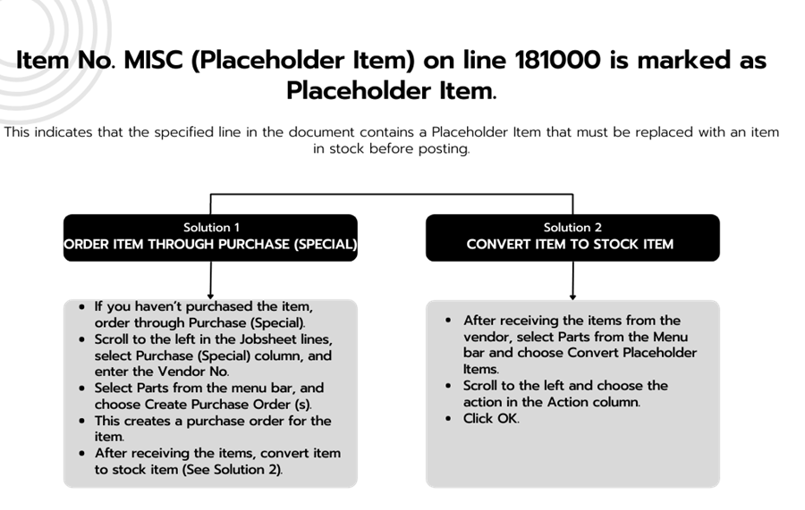
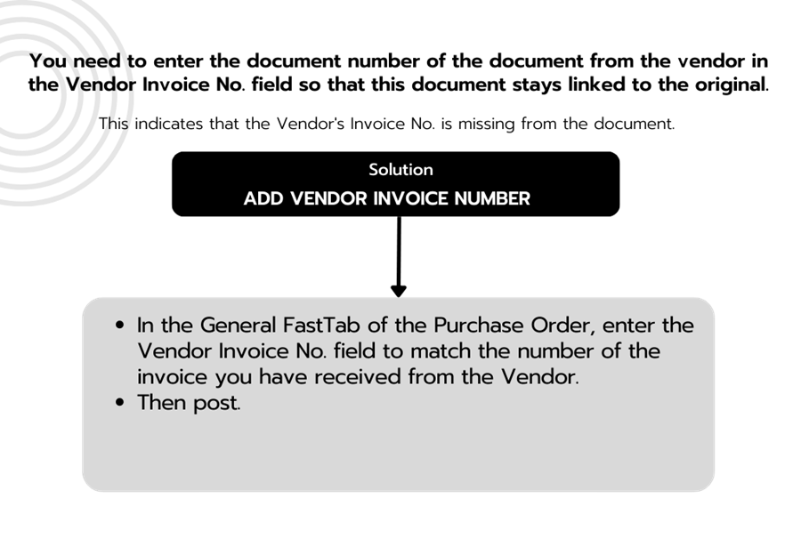
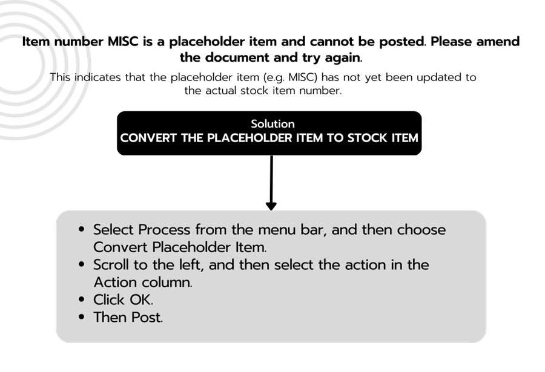
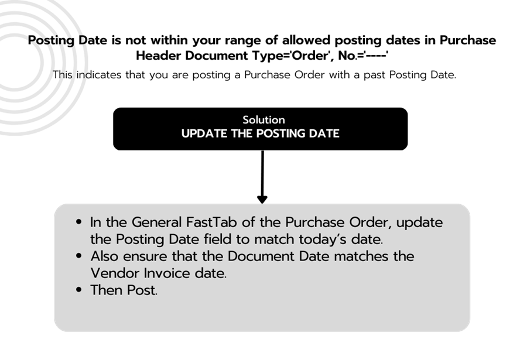

# Common Errors and Solutions When using the Garage Hive System
In order to effectively use the Garage Hive system, it is important to familiarise yourself with the various procedures and steps required to complete specific tasks. Despite this, it is not uncommon for users to encounter alerts or warnings during the initial stages of using the software. These alerts may indicate that a task has not been properly executed or that there is an issue with the system that needs to be addressed. In this article, we will provide an overview of some of the most common errors and issues that users may encounter while using Garage Hive, as well as provide solutions for addressing and resolving these problems.

## In this article
1. [Jobsheet Common Errors](#jobsheet-common-errors)
2. [Purchase Order Common Errors](#purchase-order-common-errors)

### Jobsheet Common Errors
1. **Error** - 'Document must be fully paid before posting!'
   
      

   - This indicates that the document is not yet paid, or it doesn't have payment terms.
      
|                |                                                                                   |
| :------------- | :-------------------------------------------------------------------------------- |
| **Solution 1** | **Take Payment**                                                                  |
|                | - Select Payment/Posting in the menu bar, followed by Take Payment.               |
|                | - Enter the payment for the job done in the Payment Method line, and click Close. |
|                | - You can now proceed and Post the document.                                      |
|                |                                                                                   |
| **Solution 2** | **Add Payment Terms Code**                                                        |
|                | - In the document, scroll down to the Invoicing FastTab.                          |
|                | - Enter payment terms in the Payment Terms Code field.                            |
|                | - you can now proceed and Post the document.                                      |

   **Link to Learn More** - [Taking a Payment and Posting a Jobsheet](/docs/garagehive-jobsheet-taking-payment.html#taking-a-payment-in-a-jobsheet-and-posting-it){:target="_blank"}.

1. **Error** - 'Item No. MISC (Placeholder Item) on line 181000 is marked as Placeholder Item. Current item could not be used.'

      

   **Solution** - [Working with a Placeholder Item](/docs/garagehive-creating-a-placeholder-item.html){:target="_blank"}.

      

2. **Error** - 'You have insufficient quantity of Item E1171L on inventory.'

      

   **Solution** - This indicates that the selected item is not in stock, or that more items than are in stock have been signed out in Jobsheets.

      

[Go back to top](#top)

### Purchase Order Common Errors
1. **Error** - 'You need to enter the document number of the document from the vendor in the Vendor Invoice No. field, so that this document stays linked to the original.'

      

   **Solution** - This indicates that the Vendor's Invoice No. is missing from the document.

      

2. **Error** - 'Item number MISC is a placeholder item and cannot be posted. Please amend the document and try again.'

      

   **Solution** - This indicates that the placeholder item (e.g. MISC) has not yet been updated to the actual stock item number.

      

3. **Error** - 'Posting Date is not within your range of allowed posting dates in Purchase Header Document Type='Order',No.='PO100120''.

      

   **Solution** - This indicates that you are posting a Purchase Order with a past Posting Date.

      

[Go back to top](#top)
