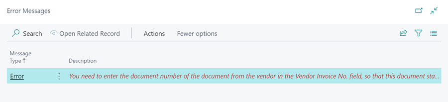

#   Common Errors Messages and Fixes 

Garage Hive is a complex system and requires certain steps to be followed to allow certain tasks to be actioned. Occasionally during the early days of using Garage Hive, you may come across some alerts/warnings as a certain task hasn't been completed. 

Please see below some of the common messages you may come across and how to fix these. 

##  Errors when posting a Jobsheet. 

**Fully Paid** - You must put a payment method within the Take Payment Button.  

**Resource Information is Missing** - This means that the labour mines do not have a resource (technicians) time allocated to it. 

This can be allocated either by selecting the Add Resources to Lines Button/ Typing in the Resource No in the Lines/ Alternatively if the technician's tick the technician confirmed box this will automatically fill this information in and prevent this error message happening. 

**NO-POST** - If you see NO-POST in an error message, this is generally because there is still a miscellaneous part on the jobsheet. 

You need to add the specific part number for this part onto the jobsheet. 

##  Errors when posting a Purchase Order. 

**Items lines with zero Value** - There is a line or multiple lines which have not had the cost price put against them.  

**Vendor Invoice No.** - You need to insert the Supplier/Vendor invoice number. 

**NO-POST** - If you see NO-POST in an error message, this is generally because there is still a miscellaneous part on the purchase order. 

**Posting/Tax Point Date is Different** - The posting date is a different date from when you are trying to post the purchase order. 

**Posting/Tax Point Date not within range** - This will not allow you to proceed as you are trying to post the document in the past. 

