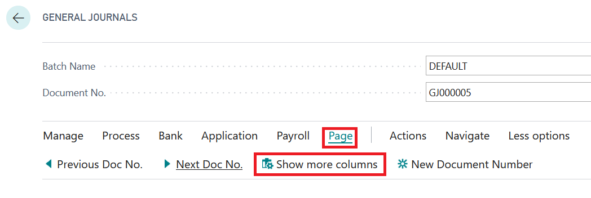
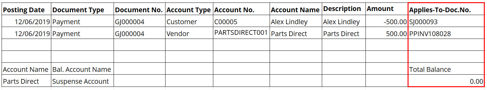
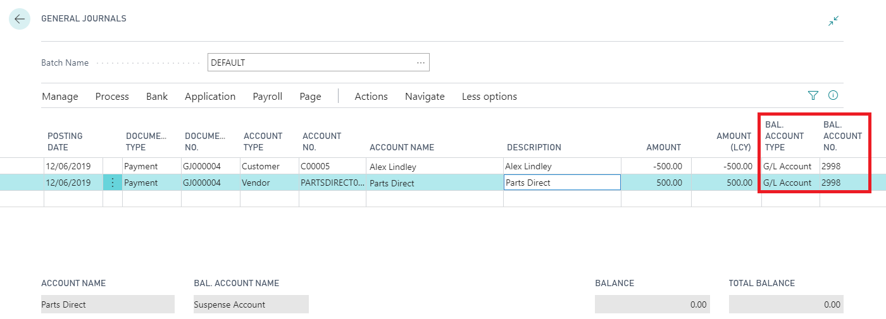

# How to perform a Customer/Vendor Balancing Payment
**Customer/Vendor Balancing Payments** (also known as **Contra Payments**) are typically made when you have a contact who is both a customer and a supplier; in the example below, you owe the supplier £1000 and the supplier owes you £500. You will owe the supplier £500 once the journal below has been posted.

**Customer/Vendor Balancing Payments** can be achieved via a general journal. Here is how:
1. In the top-right corner, choose the search icon, enter **General Journals**, and choose the related link.
2. Select **Page** from the actions bar, then **Show More Columns** to show all columns. If it's already enabled, you'll see a **Show Fewer Columns** option; leave it at that.
   
   

3. Check that the following columns are all enabled; the rest can be hidden for this journal:
   * Posting Date
   * Document Type
   * Document No. 
   * Account Type
   * Account No. 
   * Account Name
   * Description
   * Amount
   * Bal. Account Type
   * Bal. Account No. 
   * Applies-To Doc. No. 

4. There are two ways to process this journal; **the first method** is by selecting the documents that you want to balance. Select the **Applies-to Doc No.** if it's a single document, or select **Application** then **Apply Entries** if it is for multiple documents. 
5. The Journal only needs the following information entered: 
   * Posting Date
   * Document Type
   * Document No. 
   * Account Type
   * Account No. 
   * Account Name
   * Description
   * Amount
   * Applies-To Doc. No. 

6. Please note, the values are not likely to match, you must adjust the higher value down to match otherwise the journal won't balance. The below journal results in the customer and vendor balances reducing by £500, leaving the remaining balance to be physically paid. Once you are happy with journal, select **Post/Print** from actions bar, and then **Post**. 

   

**Second Method:**
1. If the payments aren't being directly applied to a document then the second method must be used. The second method utilises a balancing account, usually some form of suspense account to transfer the payment from customer to vendor. 
2. The Journal only needs the following information entered: 
   * Posting Date
   * Document Type
   * Document No. 
   * Account Type
   * Account No. 
   * Account Name
   * Description
   * Amount
   * Bal. Account Type
   * Bal. Account No. 

   

