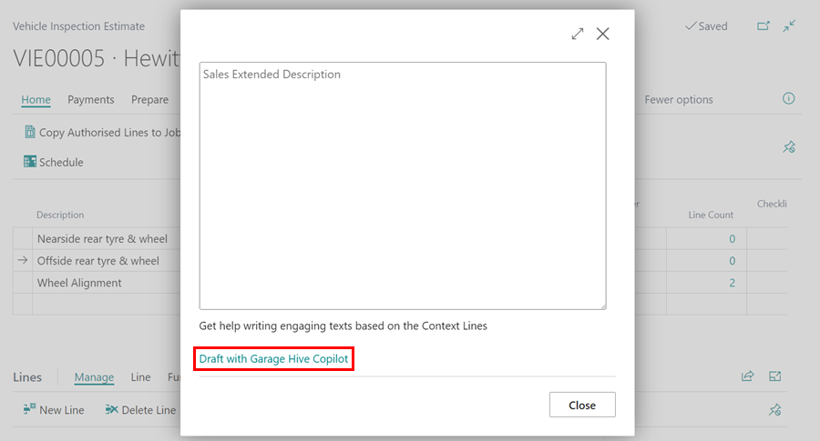

# We are still working on this article!
We are currently reviewing this article before it is published, check back later.

# In this article
1. [How to Setup Copilot and AI Capabilities](#how-to-setup-copilot-and-ai-capabilities)
2. [Assign Garage Hive Copilot Entitlement](#assign-garage-hive-copilot-entitlement)
3. [Using Copilot in VI Estimate Descriptions](#using-garage-hive-copilot-in-vi-estimate-descriptions)

## How to Setup Copilot and AI Capabilities
Garage Hive now integrates Copilot and AI capabilities to enhance the overall efficiency. By leveraging Microsoft's AI technologies, Garage Hive Copilot simplifies tasks by generating easy-to-understand descriptions in the VI Estimate. From the selected content, Garage Hive Copilot suggests a description, which the user can then customise to their preferences. To enable the Copilot and AI Capabilities:
1. In the top right corner, choose the  icon, enter **Copilot & AI Capabilities**, and select the related link.

   

2. Enable the **Allow Data Movement** on the Copilot and AI capabilities page.

   

3. Once enabled the **Status** of the **Production ready previews** capabilities will change to **Active**.

   

[Go back to top](#top)

## Assign Garage Hive Copilot Entitlement
To use the Garage Hive Copilot feature, ensure that you have assigned the GH Entitlement to your company in your system:
1. In the top right corner, choose the  icon, enter **Companies**, and select the related link.

   

2. Select the company where you want to assign the **Garage Hive Copilot** entitlement, and then select **Manage GH Entitlement** from the menu bar.

   

3. In the **Manage GH Entitlement** page, choose **Garage Hive Copilot** and click **Assign**. Then, click **Close** to exit the page.

   

[Go back to top](#top)

## Using Copilot in VI Estimate Descriptions
Garage Hive Copilot uses the fault descriptions available in the **Checklist Lines**. You can find the Checklist lines with descriptions under **Group Items** FastTab, in the **Checklist Lines Count** field in a VI Estimate. To use Garage Hive Copilot in a VI Estimate: 
1. Open the **VI Estimate**, scroll down to the **Group Items** FastTab, and click on the **Sales Extended Description** field. If the **Checklist Lines Count** field has a count, Garage Hive Copilot will automatically generate a description from it.

   

2. Click the **Draft with Garage Hive Copilot** action to generate the description.

   

3. Garage Hive Copilot will generate a draft preview of the description. You can click on **Keep It** to add it to the **Sales Extended Description** field, **Regenerate** to generate another draft description, or **Discard it** to exit the Sales Extended Description page.

   

4. To edit or view the input text from which the description is generated, click on the heading title marked with a pen icon located in the top left corner.

   

5. You can now edit the **Description** or the **Text Value** fields. Once done, click **Generate** to create a new description, or click **Discard It** to exit the Edit Prompt page.

   

[Go back to top](#top)