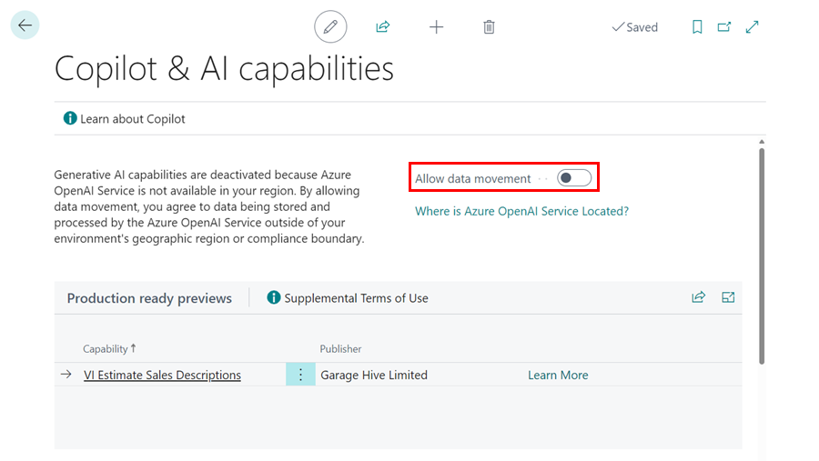

# We are still working on this article!
We are currently reviewing this article before it is published, check back later.

# How to Setup Copilot and AI Capabilities in Garage Hive
Garage Hive now integrates Copilot and AI capabilities to enhance the overall efficiency. By leveraging Microsoft's AI technologies, Garage Hive Copilot simplifies tasks by generating easy-to-understand descriptions in the VI Estimate. Users can write just a few sentences, and Copilot will generate a clearer, more understandable description. To enable the Copilot and AI Capabilities:
1. In the top right corner, choose the  icon, enter **Copilot & AI Capabilities**, and select the related link.

   

2. Enable the **Allow Data Movement** on the Copilot and AI capabilities page.

   

3. Once enabled the **Status** of the **Production ready previews** capabilities will change to **Active**.

   

4. To use the Garage Hive copilot, open the **VI Estimate**, scroll down to the lines, and click on the **Sales Extended Description** field of the line you want to use.

   

5. Enter a description, and then click on **Draft with Garage Hive Copilot**.

   

[Go back to top](#top)