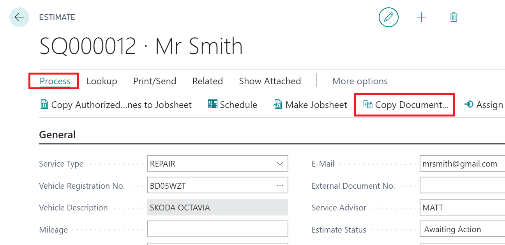
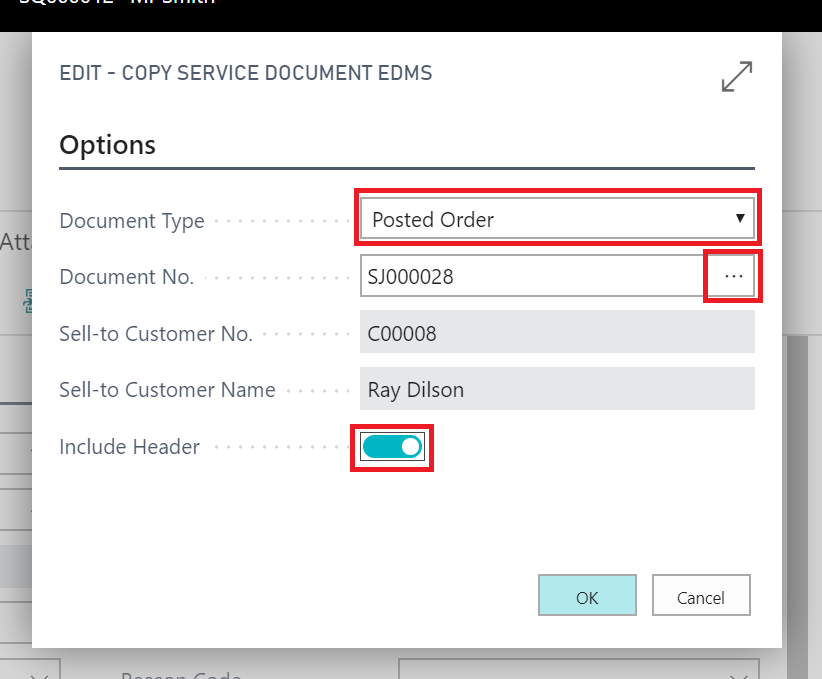

#   How to use the copy document function. 

You can copy any document into any other document in Garage Hive. 

To copy a document, select "Process" and then select "Copy Document"

Then select the "Document Type" you would like to copy. 

> Tip - Posted Jobsheets are referred to as Posted Orders. 

Use the 3 dots (...) to select the document you want to copy. 

Select "Include Header" and then press OK. 

The document will now be copied into a new document. 
