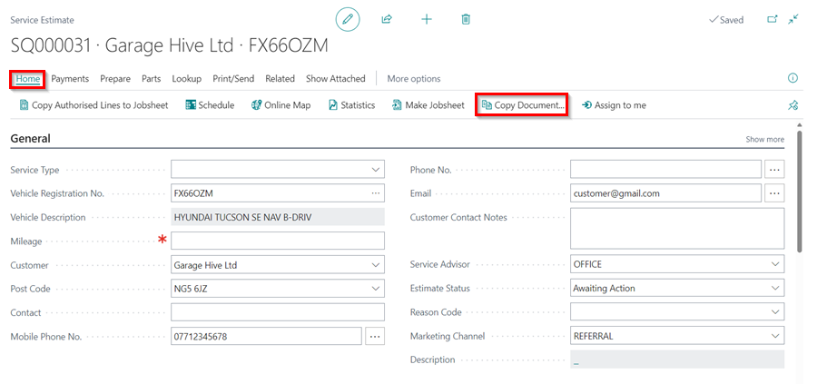
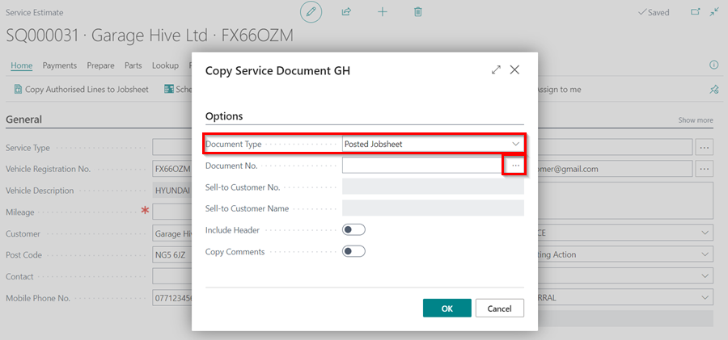

# How to use the copy document function 

In Garage Hive, you can copy any document into another document using the copy document function. You could, for example, copy a posted document into an estimate, a vehicle inspection estimate, or another Jobsheet. Let's take a look at how to copy a posted jobsheet into an estimate:
1. In the Estimate to copy the Jobsheet to, select **Home** and then **Copy Document** from the menu bar.

   

2. In the new window, select **Document Type** as **Posted Jobsheet**, and in the field **Document No.** click on the ellipsis (...) at the end, or enter the document number of the document to copy from.

   

3. You have the option of viewing the document before adding it to the estimate. To view, click on the three dots arranged vertically next to the Document **No.** column and select **View**.
4. Then, click **OK** to add the document.

   

5. Now, you can select the sliders **Include Header** to add the Jobsheet's header (Which includes customer details, vehicle details, reminder dates, etc), and/or **Copy Comments** to copy the comments from the posted Jobsheet.
6. Then click **OK**. The posted jobsheet will now be copied into the estimate.

   



[Go back to top](#top)