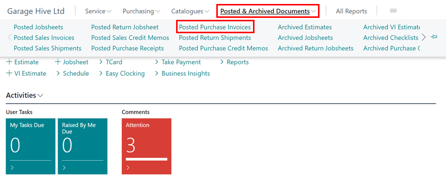

#   Correct or Cancel a Purchase Invoice.

If you have posted a purchase order for the incorrect amount or to the incorrect Vendor, you can cancel the purchase order by following the steps below: - 

Within the Home Screen select **Posted & Archived Documents**

Then select **Posted Purchase Invoices**

Find the required posted purchase invoice within the list or use the search option and then open.  

Then select **Correct** followed by Cancel Invoice. 

You will then see the following message, advising a purchase credit memo will be created and posted. This will reverse this purchase invoice.  

If the original purchase order was posted before the day you are cancelling the document you will get the following message. Select **Yes**. 

Finally, you will see this message. This confirms the credit memo was posted successfully. You do not need to open this, however, you can if you wish. 

If it was posted incorrectly, you simply now just need to create a new purchase order. 

