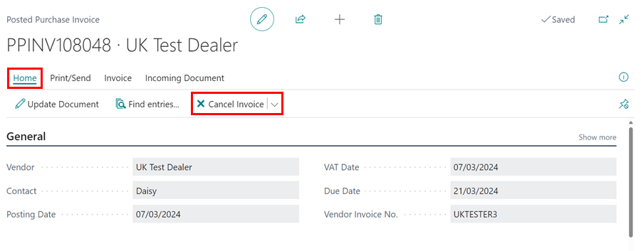
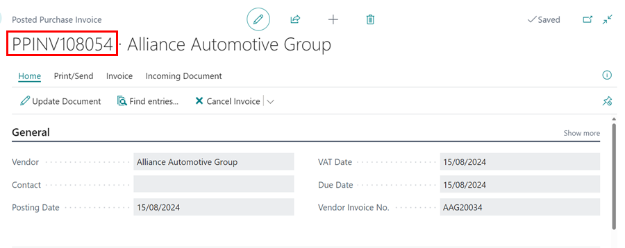

## In this article
1. [Cancel a Purchase Invoice](#cancel-a-purchase-invoice)
2. [Correct a Purchase Invoice](#correct-a-purchase-invoice)

### Cancel a Purchase Invoice

   

If you accidentally posted a purchase order for the incorrect amount or to the wrong Vendor, you can cancel it by following the steps below: 
1. Select **Posted & Archived Documents** in the **Role Centre**, then **Posted Purchase Invoices**.

   

2. Use the **Search** option to locate the required **Posted Purchase Invoice** in the list, and then **Open** it.

   

3. Select **Correct** from the menu bar, followed by **Cancel Invoice**.

   

4. The following message will appear, informing you that a purchase credit memo will be created and posted. This will result in the purchase invoice being reversed. Select **Yes**.

   

5. You'll get the following message if the original purchase order was posted before the day you're cancelling the document. Select **Yes**. 

   

6. After that, you'll see this message. This confirms that the credit memo was successfully posted. You are not required to open this, but you may do so if you so wish.

   

7. You'll need to create a new purchase order if it was posted incorrectly.

### Correct a Purchase Invoice
If you want to correct the Purchase Invoice:
1. Select the Purchase Invoice to correct, from the list of **Posted Purchase Invoices**. Select **Correct** from the menu bar, followed by **Correct**.

   

2. If the Purchase Invoice was created by posting a purchase order, a credit memo will be created and you can create a new Purchase Invoice.

   

3. If the Purchase Invoice was created by posting a Purchase Invoice, a new version of the Purchase Invoice will be created so that you can make the corrections.

   

4. Enter the corrections in the newly created Purchase Invoice, and post it when done.

   

[Go back to top](#top)

## See Also

[Video: How to Cancel an Incorrect Purchase Invoice in Garage Hive](https://www.youtube.com/watch?v=klNMViU-6Ls){:target="_blank"}

