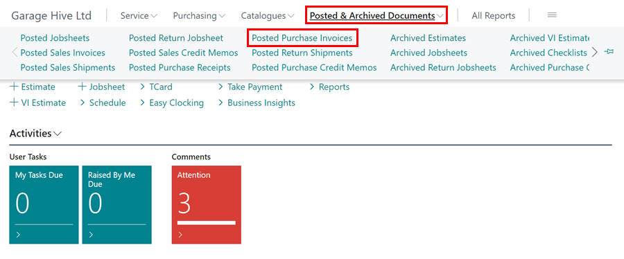
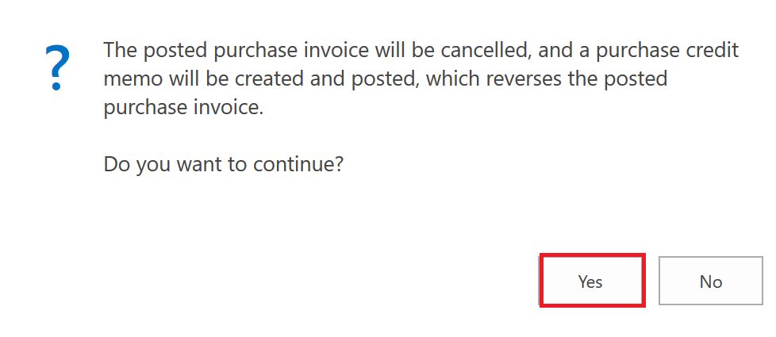
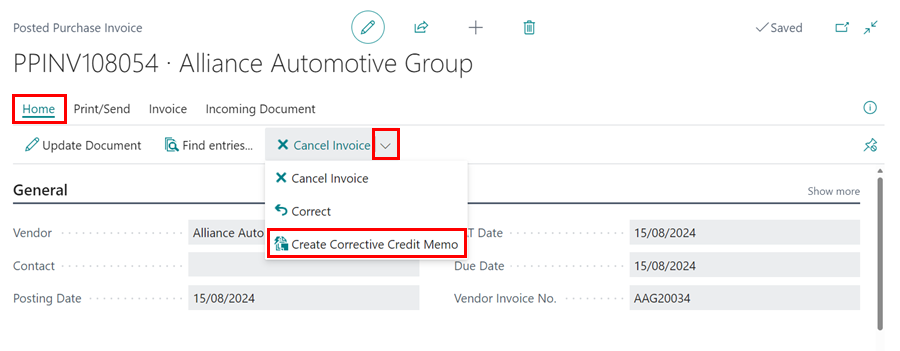
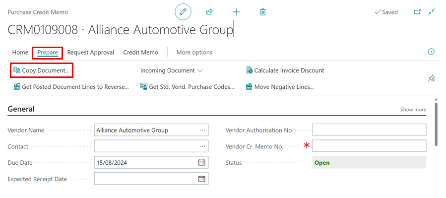
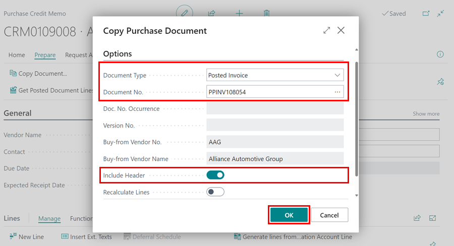
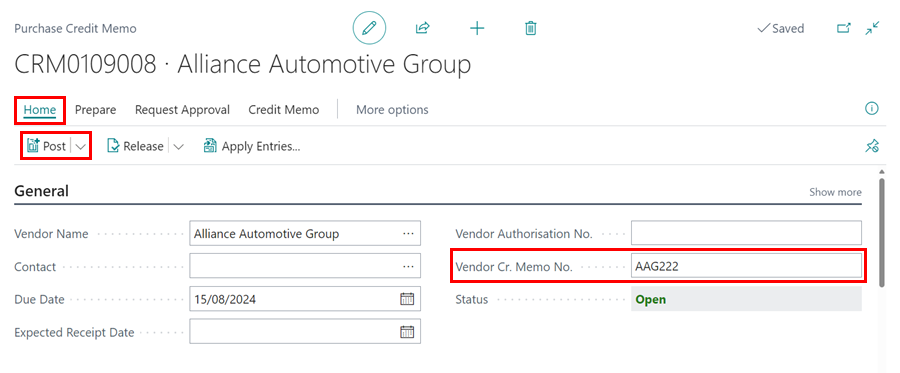

## In this article
1. [Cancel a Purchase Invoice](#cancel-a-purchase-invoice)
2. [Correct a Purchase Invoice](#correct-a-purchase-invoice)

### Cancel a Purchase Invoice

   

If you accidentally posted a purchase order for the incorrect amount or to the wrong Vendor, you can cancel it by following the steps below: 
1. Select **Posted & Archived Documents** in the **Role Centre**, then **Posted Purchase Invoices**.

   

2. Use the **Search** option to locate the required **Posted Purchase Invoice** in the list, and then **Open** it.

   

3. Select **Correct** from the menu bar, followed by **Cancel Invoice**.

   

4. The following message will appear, informing you that a purchase credit memo will be created and posted. This will result in the purchase invoice being reversed. Select **Yes**.

   

5. You'll get the following message if the original purchase order was posted before the day you're cancelling the document. Select **Yes**. 

   

6. After that, you'll see this message. This confirms that the credit memo was successfully posted. You are not required to open this, but you may do so if you so wish.

   

7. You'll need to create a new purchase order if it was posted incorrectly.

### Correct a Purchase Invoice
To correct a **Posted Purchase Invoice:**
1. From the Role Centre, select **Posted and Archived Documents** followed by **Posted Purchase Invoices**.

   

2. Choose the Purchase Invoice you want to correct from the list of **Posted Purchase Invoices**, then open it. Copy the **Invoice Number** found on the top left corner of the page. You will need it later.

   

3. Click on **Correct** from the menu bar, then select **Create Corrective Credit Memo**.

   

4. In the **Purchase Credit Memo** that opens, select **Prepare** and then **Copy Document**.

   

6. On the **Copy Purchase Document** page, select **Document Type** as **Posted Invoice**. Paste the document number you copied earlier in the **Document No.** field, then tick the **Include Header** slider. Once done, click **OK**.

   

7. When you click **OK**, you will have a credit that will cancel the original **Purchase Invoice**. 
8. If you leave it open for now and then create a new Purchase order for the correction to be made (you can use the **Copy document** feature again to make this process quicker). 
9. After posting the **New Purchase Order**, post the credit memo to complete the correction process.

   

[Go back to top](#top)

## See Also

[Video: How to Cancel an Incorrect Purchase Invoice in Garage Hive](https://www.youtube.com/watch?v=klNMViU-6Ls){:target="_blank"}

