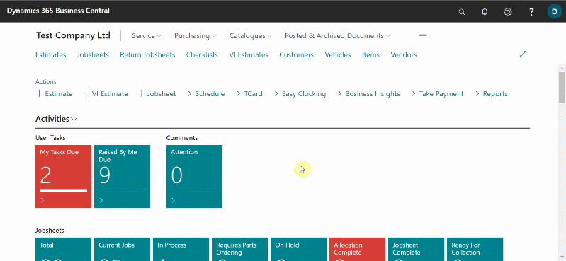
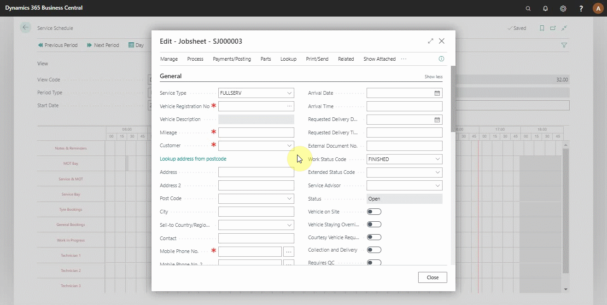
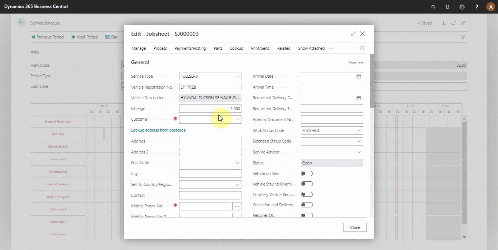
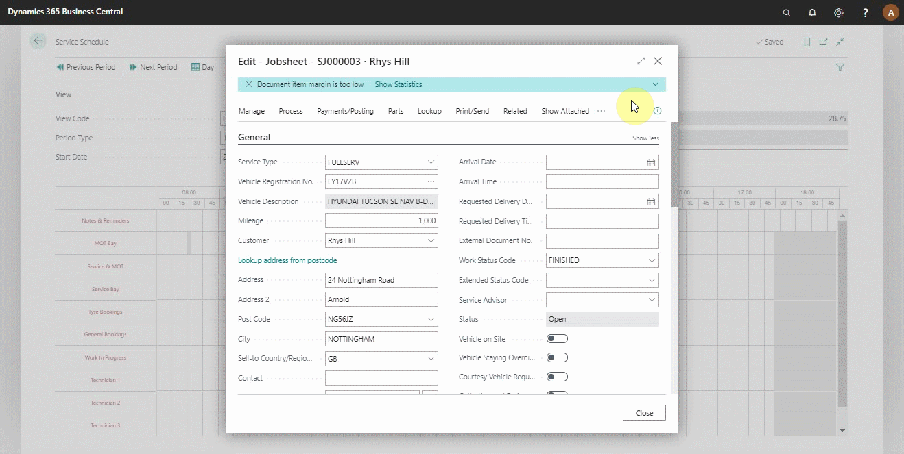
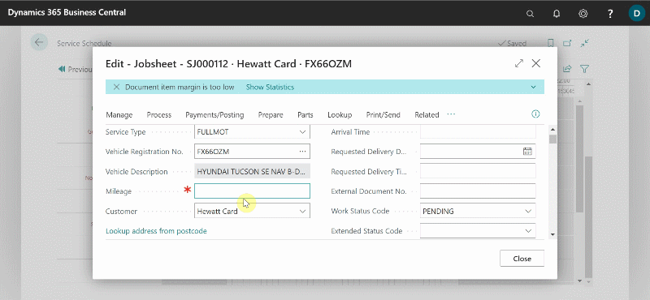

# Creating a booking from the Schedule
To create a booking from the schedule:
1. Open the schedule from the **Role Centre**, and then choose the relevant day for the booking in the **Start Date** field. Press the **Tab** key.

   

2. For a **Technician**, find the technician's name to allocate for on the left side and the time to allocate at the top. To begin the allocation, click on the row from the start time. Drag up to the time you want the allocation to finish without releasing the mouse.
3. Select the **Allocation Type** from the pop-up menu, which can be a **warranty job**, an **existing Jobsheet** or a **standard event**. Click **OK**.

   

4. For other resources, such as **MOT Bay**, choose the **Allocation Type** after creating the allocation by dragging along the row. Enter the **Vehicle Registration No.** and press the **Tab** key. 
5. If the vehicle is in the system, you will be notified that it is linked with a customer, and you will be able to apply allocation to the customer.

   

5. If the vehicle is not in the system, the system will find it using the VRM, and you will now need to provide the customer information in the **Customer** field. If the customer is already in the system, you can choose from the list; or else, create a new **Customer** card.

   

6. Add any information that the customer has given in the **Comments** FastTab about the job on the vehicle. The top line is the line the technician will see prior to to opening the job card, add the most relevant information in this line. **Close** the open page.

   

 

### **See Also**
[Video: How to schedule a booking in Garage Hive](https://www.youtube.com/watch?v=4bic2AH6Lrw) \
[Understanding the Schedule](garagehive-understanding-the-schedule.html)