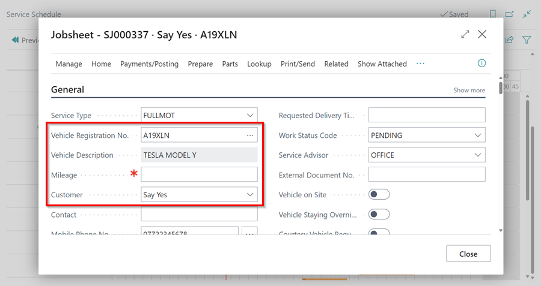
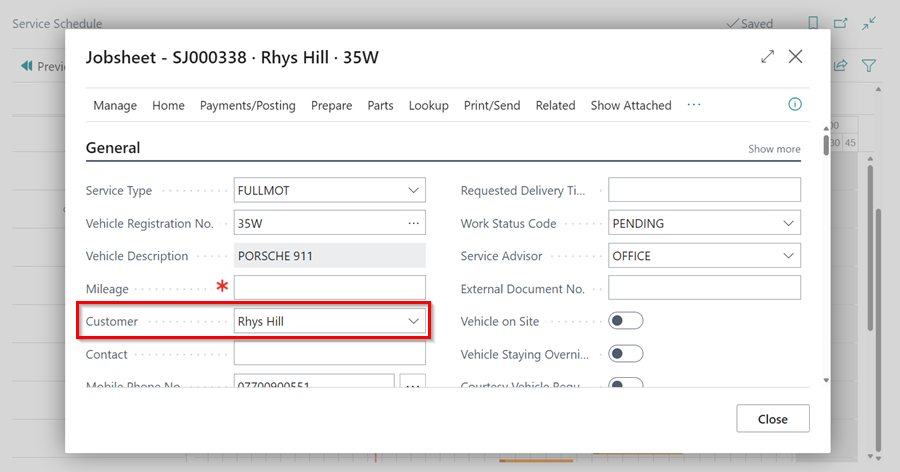
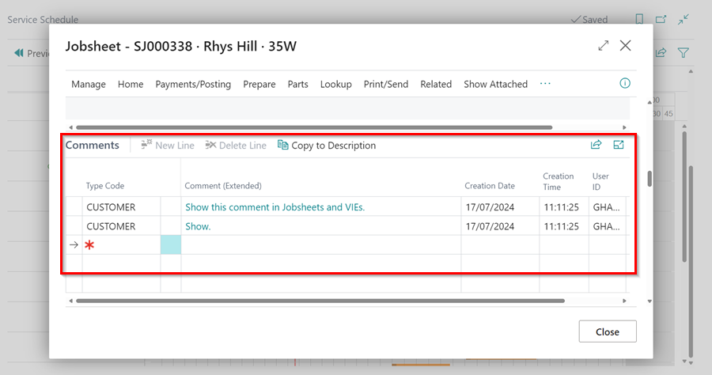

# Creating a booking from the Schedule



1. Select relevant day for booking

2. Find relevant allocation row/technician

3. Click on the relevant line at the start time required. 
Drag and drop for length of time for booking required.   Select required allocation type. 

4.	Fill in Vehicle Registration No. 

5.  If the vehicle has been in before it will fine the customer card. 

6. If the vehicle has not been in before it will find the vehicle using VRM.  
            - You will now need to fill in the Customer box.  
            - Type in the customers name how you would like to appear on the invoice. 
            

- If the customer has been in before with another vehicle. It will find the customer details. 

7.  If customer has not been in before it will ask you to (Create a new customer card).

6. Fill in this section with as much information as you require (Use Lookup Address Action in the ribbon for postcode search).

7.	 Fill in comments box with any information the customer has supplied regarding the job. (Top line is the line the technician will see against their tasks prior to opening the job card. Put most relevant information in this line).

