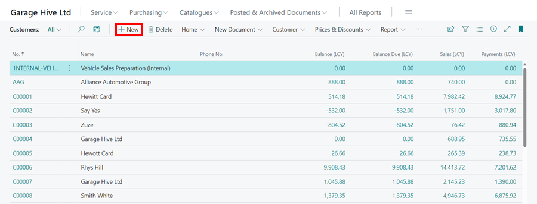
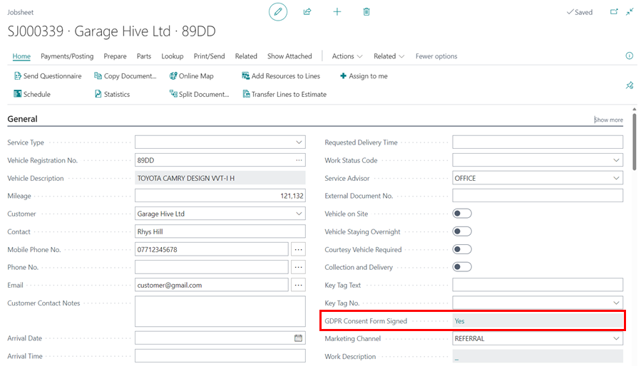

# How to Create a Customer Card in Garage Hive 
A Customer card in Garage Hive stores all the details about a customer. This includes the customer's name, address, phone number, email address, payment details, invoicing details and other relevant information. A Customer card can either be created from the Role Centre/Home Screen or when [Creating a Booking](garagehive-create-a-booking.html) for a new customer. In this case we'll look at how to create a customer card from the Role Centre.

## Creating a Customer Card From the Role Centre
1. From the Role Centre, select **Service**, followed by **Customers**.

   

2. Click on **New** in the Customer list that opens.

   

3. A new Customer card will now be created, and you can start adding details about the Customer. 

## Customer Card Details Sections
The Customer card is divided into several sub-categories, as listed below:

#### 1. General Information
In the **General** section, you can add or view general Customer details, such as the **Name**, assigned **No.** in the system, **External System No.**, **Credit Limit (LCY)**, whether they are **Blocked** or not, among other general information about the Customer. Click on **Show More/less** in the top right of the **General** section, to reveal more fields or hide some of the fields.

   

#### 2. Address & Contact
The customer's address and contact details are contained in this section. After entering the address details, you can select **Show on Map** to view the exact location on maps.

   

#### 3. Invoicing
In the **Invoicing** section, the posting details of the Customer are added here.

   

   - **Bill-to Customer** - This is the Customer to whom the charge will be applied as well as the name that will be printed on the invoice. (*I.e. If you have a customer who had a lease car, you want their name to remain attached to the car. But you want the invoice to be charged to the lease company, you can change this here.*)
   - **VAT Registration No.** - If the Customer is registered for VAT, this can be filled in here.
   - **Promote Sell-to Cust.on Invoice** - Tick this box, if you are changing the Bill-to Customer, but you wish the Sell-to Customer's name to remain on the invoice.
   - **Gen. Bus. Posting Group** - These are pre-defined fields to select from.
   - **VAT Bus. Posting Group** - These are pre-defined fields to select from. Please note that the majority of the time this should be set up as **DOMESTIC.**
   - **Customer Posting Group** - These are pre-defined fields to select from. Please note that the majority of the time this should be set up as **DOMESTIC.**
   - **Customer Price Group** - You can select specific Pricing Groups for individual customers. See link below. 
   - **Customer Disc. Group** - You can select specific Discount Groups for individual customers. See link below.

   

#### 4. Payments
In the **Payments** section, we have the payment method, payment terms, reminder terms, and other related information about the customer's payment.

   

#### 5. GDPR and Communication Policy
In the GDPR and Communication Policy section, You can tick off the customer's communication preferences.

   

Once the GDPR Consent Form is signed, enable the **GDPR consent form signed** slider.  

   

In the customer's Jobsheet, the signed GDPR Consent form status will be displayed as **Yes**.

   

[Go back to top](#top)