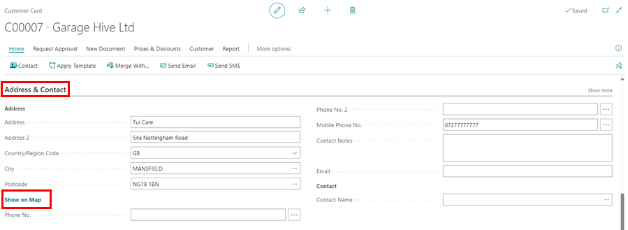
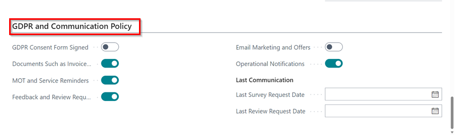

#   Create a Customer Card. 

A customer card can be made in several ways.

Either from the home screen or when [Creating a Booking](https://docs.garagehive.co.uk/docs/garagehive-create-a-booking.html "Creating a Booking") for a new customer. 

Then Select + new 

#   You will not be able to start building the Customer Card. 

####    The Customer Card is split down into several sub-categories. 

##  GENERAL 

A.  **No. (Sell to Customer)** 

B.  **External System No.**

C.  **Name**

D.  **Credit Limit (LCY)**

E.  **Blocked**

F.  **Show less/more** 

##  ADDRESS & CONTACT 

A.  **Lookup Address** - Select Lookup Address button within the ribbon. 

B.  **Postcode** - Complete Postcode. 

C.  **Building No.** - You can either put the building no. in or leave this blank.  *If you leave this blank it will show all addresses within that postcode.** 

D.  **Address** - If you have used the Lookup Address, this will automatically be completed. If not you can complete manually. 

E.  **Phone No.** - Complete landline contact number, *(if available*).

F.  **Mobile Phone No.** - Fill in Mobile Phone No. This will allow you to send SMS messages to this specific number. 

G.  **Email** - Fill in Email information - This will allow you to email documents such as Invoices/Proforma/Vehicle Health Checks etc. 

##  INVOICING 

A. **Bill-to Customer** - This is who the charge will go to. Also the name which will appear on the invoice.

*I.e. If you have a customer who had a lease car, you want their name to remain attached to the car. But you want the invoice to be charged to the lease company, you can change this here.*  

B.  **VAT Registration No.** - If the customer is VAT registered, this can be filled in here. 

C.  **Promote Sell-to Cust.on Invoice** - Tick this box, if you are changing the Bill-to Customer, but you wish the Sell-to Customer's name to remain on the invoice. 

D.  **Gen. Bus. Posting Group** - These are pre-defined fields to select from. 

**DO NOT Create your own without discussing with a member of the Support Team.**  

E.  **VAT Bus. Posting Group** - These are pre-defined fields to select from. 

**DO NOT Create your own without discussing with a member of the Support Team.**  

Please note that the majority of the time this should be set up as **DOMESTIC.**

F.  **Customer Posting Group** - These are pre-defined fields to select from. 

**DO NOT Create your own without discussing with a member of the Support Team.**  

Please note that the majority of the time this should be set up as **DOMESTIC.**

G.  **Customer Price Group** - You can select specific Pricing Groups for individual customers. See link below. 

H.  **Customer Disc. Group** - You can select specific Discount Groups for individual customers. See link below. 

##  PAYMENTS

You can set a specific customer payment terms within the customer card. 

## GDPR AND COMMUNICATION POLICY 

Within the GDPR and Communcation Policy section, you can tick off the customer's preferences for communcation. 

Once the box for GDPR Consent Form signed box is ticked it will show YES on a jobsheet for this specific customer.  

The customer card can be edited by selecting the Edit button within the Ribbon. 

This is your customer card now created. 

#   See Also

 [Creating a Booking](https://docs.garagehive.co.uk/docs/garagehive-create-a-booking.html "Creating a Booking") 

 

 

