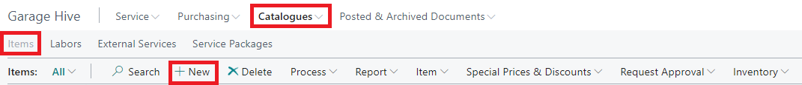
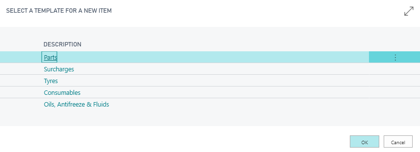
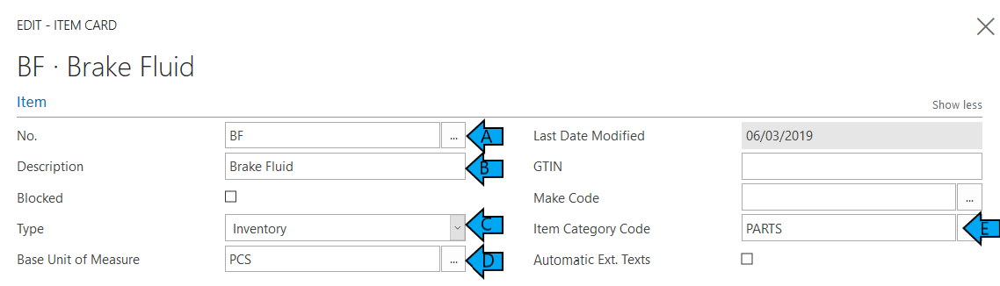
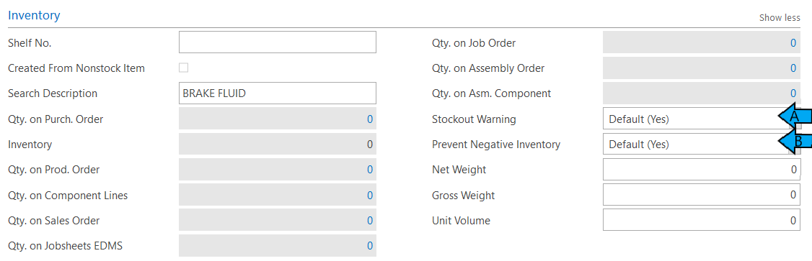
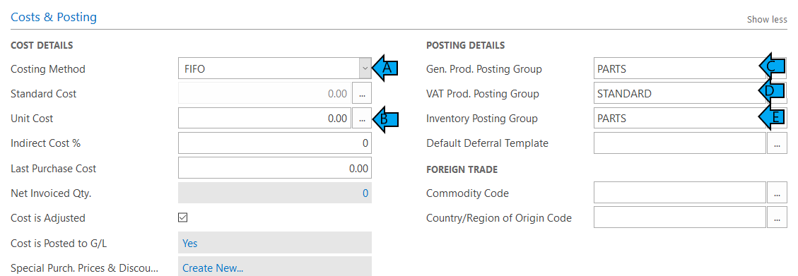
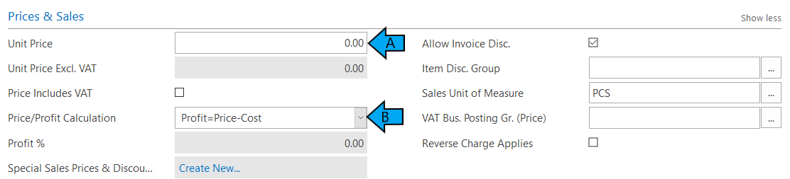
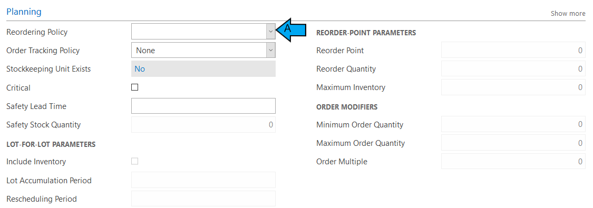

#   Create a Item Card.

*   Select Catalogues in the Home Screen. 

*   Followed by Items 

*   Choose **+ New**    

*   Select most relevant template for the item you wish to create. *This will pre select the item category within the item card.*

#   You will now be able to start building the Item Card. 
####   The item card is split down into several Sub-Categories 

## ITEM

A. **No.**  - This needs to be the part number either from your supplier or set part number you wish to give a particular part.    

*i.e. BF for Brake Fluid. So everytime you order this from any supplier you can use the same part number.* 

B.  **Description** - The description of the part. *This description will be what appears on the jobsheet/invoice.*

C.  **Type** - Select Inventory 

D.  **Base Unit of Measure** - Select the relevant unit of measure.  

*i.e.  
BF - Brake Fluid - Unit of Measure = LTR (Litre)* 
*Bulb - Bulb - Unit of Measure = PCS (Piece)*  
*BP - Brake Pipe - Unit of Measure = MTR (Metre)*

E.  **Item Category Code** - This is pre-selected when chosing which item template for the item card. 

##  INVENTORY 

A.  **Stockout Warning** - This is always preset to "Default (Yes)". This will alert you if you try and sell something out which is not in stock. 

This can be changed to "No" in certain scenarios.   

*i.e. CONSUMABLES - You are wanting to add a Consumables Cost on your invoices rather than booking out specific parts each time.*

B.  **Prevent Negative Inventory** - This is always preset to "Default (Yes)". This will prevent you selling something out you do not have in stock.

This can be changed to "No" in certain scenarios.   

*i.e. CONSUMABLES - You are wanting to add a Consumables Cost on your invoices rather than booking out specific parts each time.*

##  COSTS & POSTING 

A.  **Costing Method** - FIFO (First In First Out)

B.  **Unit Cost** - This will automatically be populated when receiving the part in via a purchase order. 

C.  **Gen. Prod Posting Group** - These are pre-defined fields to select from. 

**DO NOT Create your own without discussing with a member of the Support Team.**  

D.  **VAT Prod. Posting Group** - These are pre-defined fields to select from. 

**DO NOT Create your own without discussing with a member of the Support Team.**  

Please note that the majority of the time this should be set up as **STANDARD.**

E.  **Inventory Posting Group** - These are pre-defined fields to select from - Usually linked to the specific Item Category Code used. 

**DO NOT Create your own without discussing with a member of the Support Team.**  

##  PRICES & SALES 

A.  **Unit Price**  - You can set a fixed price you wish this item to be sold out at each time. 

B.  **Price/Profit Calculation** - Profit=Price-Cost

##  PLANNING

A.  **Reordering Policy** - This is where you can select a part to be a stock item, so that it will not show on your *"Items to Return Report"*.

 #   See Also 

[Items to Return Report](/docs/garagehive-items-to-return.html "Items to Return Report")

