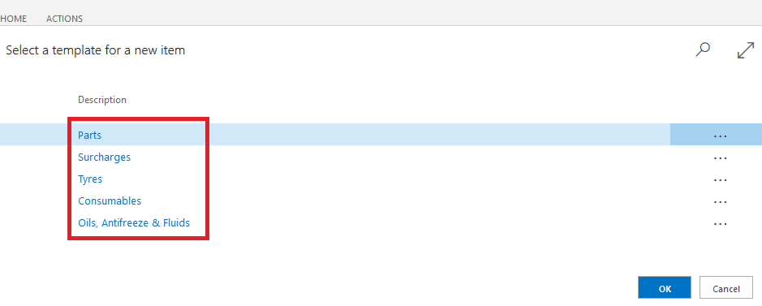

#   Create a Item Card.

*   Select Catalogues in the Home Screen. 

A.  Select Items 

B.  Select Create +new 

*   Select most relevant template for the item you wish to create. 

#   You will now be able to start building the Item Card. 
####   The item card is split down into several Sub-Categories 

## ITEM

A. **No.**

B.  **Description**

C.  **Type**

D.  **Base Unit of Measure**

E.  **Item Category Code**

##  INVENTORY 

A.  **Stockout Warning**

B.  **Prevent Negative Inventory**

##  COSTS & POSTING 

A.  **Costing Method**

B.  **Unit Cost**

C.  **Gen. Prod Posting Group**

D.  **VAT Prod. Posting Group**

E.  **Inventory Posting Group**

##  PRICES & SALES 

A.  **Unit Price**

B.  **Price/Profit Calculation**

