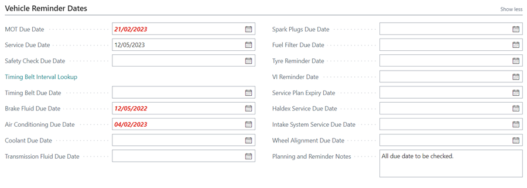
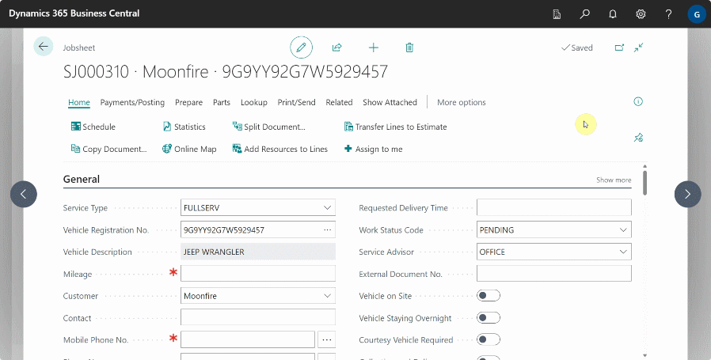

# Creating a Jobsheet 
There are various methods for creating a jobsheet, as described in [this article](garagehive-jobsheet-create-from-various-places.html). In this article we'll look at the standard way to create a new Jobsheet.

## In this article
1. [Creating a new Jobsheet](#create-a-new-jobsheet)
2. [Add Items and Labour](#add-items-and-labour)
3. [View the Factbox and copy the VIN](#view-the-factbox-and-copy-the-vin)
4. [Setup for Jobsheet Deletion Reasons](#setup-for-jobsheet-deletion-reasons)

### Create a new Jobsheet
1. Select **Jobsheets** in the Home Screen, and then choose **New.**
1. Select the **Service Type** - This is the type of job to do.

   

1. Fill in the **Vehicle Registration No.**:
    - If the vehicle is in the system, the vehicle information will be auto-filled.
    - If the vehicle is not in the system, the system will look it up using **VRM** to obtain the vehicle's details.
1. Enter the current vehicle mileage, in the **Mileage** field.

    

1. After the VRM lookup for the vehicle, enter the customer information:
    - If the customer's information was previously entered for another vehicle, the system will obtain the customer's information and link it to the vehicle.
    - If the customer is new to the system, the system will prompt you to [Create a new customer card](docs/garagehive-create-a-customer-card.html "Create Customer Card").
1.  Fill in **Address & Contact** FastTab in the **Customer** card:
    - Select **Lookup Address from Postcode**, enter the **Postcode**, click **OK**, and then select the appropriate address.
    - Fill in the contact information, including phone number and email address.

         

1.  You can now add the following details:
     - **Arrival Date** and **Arrival Time** - This is the day and time the vehicle will arrive on site, or when it is expected to arrive.
     - **Requested Delivery Date** and **Requested Delivery Time** - This is the date and time the customer has requested that the car be delivered after the work has been completed.
     - **External Document No.** - This is the number for the external document that is related to the work being done on the vehicle.
     - **Work Status Code** - This is the status of the work being done on the vehicle.
     - **Vehicle on Site** - This indicates that the vehicle is on site.
     - **Vehicle Staying Overnight** - This indicates that the vehicle will be staying overnight in the garage.
     - **Collection and Delivery** - This indicates whether the car should be picked up from the customer's location and delivered once the work is completed.
     - **Key Tag Text** - This is the number marked on the vehicle key attachment, which can also be a text.
     - **Key Tag No.** - This is the number marked on the vehicle key attachment, and set up in the system to help also identify parts that belong to the vehicle by using the same number in a purchase order.
     - **Marketing Channel** - This is the channel through which the customer found the business.
     - **Work Description** - This is the description of the products or services being offered, it appears at the top of the invoice when printed.

      

1.  The **Vehicle Reminder Dates** FastTab shows the dates on which various vehicle parts should be changed, serviced or checked.

   

1. Under the **Checklist** subpage, you may view and access any checklists that are linked to the jobsheet.

      

1. In the **Comments** subpage, you can enter any information the customer has provided about the job to be done. 

      
   
1. Under the **Group Items** section, you create groups where you add lines based on group title.  The groups help in the categorisation of the lines. Read more here [Grouping document lines](garagehive-group-items-grouping-document-lines.html). 

    

### Add Items and Labour
1. You may now begin adding **Labour** lines, **Item** lines, or **Service Packages** to the jobsheet:
    - **Type** column - Select either **Labour** or **Item** to define what type of details are to be entered in the line.
    - **No.** column - Enter the number for **Labour** or **Item** as added in the system. For example, for labour, you can choose **service labour**, **standard labour**, and so on; for item, you can choose **inventory items** like air filters and engine oil, **non-inventory items** like consumables, or **external services**, and so on.
    - **Description** column - This is the item or labour description that will appear in the customer's invoice.
    - **Quantity** column - Enter the quantity of items or hours to sell.
    - **Unit Cost** column - This is the cost of an item to the business. This field is left blank for labour.
    - **Unit Price** - This is the price at which the customer will buy the item or labour per unit.
    - **Unit Price (Calc) Incl. VAT** column - When you click on the amount in this field, a pop-up window will appear, showing the **Unit Price**, **Margin %**, **Unit Price Incl. VAT**, and **Total Incl. VAT**, allowing you to do price calculation.
    - **Line Discount %** column - If you want to apply a discount to the line, within this field, fill in the percentage discount.
    - **Line Discount Amount** column - This is the amount applied to the line as a discount. By default this column is not visible, but you can use [personalisation](garagehive-personalising-garage-hive.html) to add it.
    - **Line Amount Excl. VAT** - This is the pre-VAT total line amount.
    
         

### View the Factbox and copy the VIN
1. The **FactBox** is located to the right of a jobsheet and provides quick information and links about the work being done on the jobsheet, the customer, and the vehicle, including a link to immediately **Copy the VIN**.

      

### Setup for Jobsheet Deletion Reasons
To setup Jobsheet deletion reasons:
1. In the top-right corner, choose the  icon, enter **Service Mgt. Setup GH**, and select the related link.
2. Scroll to the **Archive** FastTab and select the **Ask for Reason on Jobsheet Delete** slider to the right. Exit the setup page.

   

3. To personalise your Jobsheet deletion reasons, click the search icon, enter **Document Deletion Reasons**, and select the related link.
4. Choose **New** from the actions bar, then **Document Type** as **Jobsheet**, a **Code** for the reason, and then the description. For example, you may enter **Booking** as the code and **Booking Cancelled** as the description.
5. Add several reasons and then exit the page when done.

   

6. Open the Jobsheet to delete, and at the top of the jobsheet, you'll see an icon to delete a jobsheet; click on it, choose **Yes** on the pop-up, and choose the reason for deleting the Jobsheet.

   

 

### **See Also**

[Grouping document lines](garagehive-group-items-grouping-document-lines.html) \
[Creating a New Jobsheet From Various Places in Garage Hive](garagehive-jobsheet-create-from-various-places.html) \
[Taking a Payment and Posting a Jobsheet](garagehive-jobsheet-taking-payment.html) \
[Posted & Archived Jobsheets](garagehive-posted-archived-documents.html) \
[Managing Key Numbers in Garage Hive](garagehive-managing-key-numbers-in-the-system.html) \
[Customising Vehicle Reminder Dates](garagehive-customising-vehicle-reminder-dates.html)