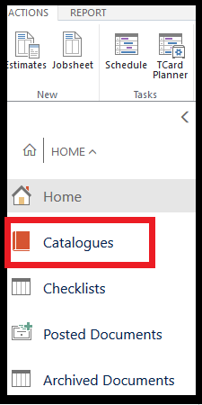

#   Create a Labour Card 

### You can create as many customised labour cards as you like. 

### Creating Labour Cards will allow you to pre-populate set Labour Times and Labour Costs for specific jobs. 

### ***Labour Cards can also be used to build Service Packages.***  

*   Select Catalogues in the Home Screen.

    
    
a.  Select Labours

b.  Select Create + new

##    *You will now be able to start building the Labour Card*

A.  **No.** - Create a unique and relevant Labour No (Code) - Complete without Spaces

B.  **Description** - This is the description which will be shown on the jobsheet/invoice. 

C.  **Group Code**  - This is the Labour Group to which you require the Select the most relevant group code.

*   AC
*   ALIGN
*   DIAG
*   LABOUR
*   MOT
*   TYRE 

D.  **Unit of Measure Code** - Select (HOUR) 

E.  **VAT Bus. Posting Gr. (Price)** - Select the most relevant from the options 

*   DOMESTIC - Domestic customers and vendors 
*   EU - Customers and vendors in EU
*   EXPORT - Other customers and vendors (not EU) 

F.  **Unit Price** - This is to be the total unit price. This will vary depending on your **Standard Times**. Example below: - 

*You charge a brake fluid change at £30plus VAT and allow 30 mins labour.* 

*Unit Price = 60.00* 
*Standard Times = 0.5*

G.  **Price/Profit Calculation** = Profit=Price-Cost 

H.  **Profit %** = 100

I.  **Gen Prod. Posting Group** - These are pre-defined fields to select from.  

 ***DO NOT - Create your own without discussing with a member of the Support Team.***

Select the most relevant General Product Posting Group. 

*   CONS - Consumables 
*   DIAG - Diagnotic 
*   EXTERNAL - External Services 
*   FLUIDS - Fluids 
*   MISC - Miscellaneous 
*   NO-POST - Miscellaneous No Post Items 
*   PARTS - Parts 
*   TYRES - Tyres 

J.  **VAT Prod. Posting Group** - These are pre-defined fields to select from.  

***DO NOT - Create your own without discussing with a member of the Support Team.***

Please note that the majority of the time this should be set up as **STANDARD**. 

