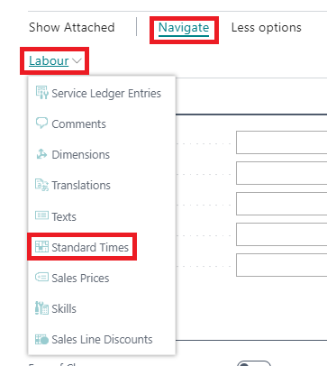
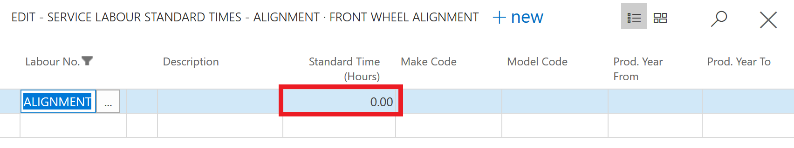

## In this article
1. [Creating a labour card](#creating-a-labour-card)
2. [Using Standard Times](#using-standard-times)

### Creating a labour card
To create a new **Labour Card**:
1. Select **Catalogues** from the role centre, then **Labours**.
2. Select **New** from the actions bar to create a new labour card and start entering the labour details.

The labour card is divided into the following FastTabs:

#### General
Fill in the following details:
1. **No.** - This is the unique code for the labour in the system. Create one without spaces, and with less than 20 characters.
2. **Description** - This is the description of the labour which will be shown on the jobsheet/invoice.
3. **Type** - This is they type of labour; select from the predefined list in the system.
4. **Group Code**  - This is the Service Labour Group Code that groups all the labours in the same category.
5. **Unit of Measure Code** - This is the Unit of Measure for the labour; select **HOUR**.

    

 #### Invoicing
 Fill in the following details:
 1. **VAT Bus. Posting Gr. (Price)** - 
 2. **Unit Price** -  This is the selling price of the labour, and you can set a price for selling this labour every time it’s sold.
 3. **Price/Profit Calculation** - This is the formula used for **Price** and **Profit**; select **Profit=Price-Cost**.
 4. **Profit %** - This is the percentage Profit for the labour; set it as **100%**.
 5. **Gen Prod. Posting Group** - This is the labour’s product type to link transactions made for this labour with the appropriate general ledger account according to the general posting setup; select the appropriate group from the pre-defined list.
 6. **VAT Prod. Posting Group** - This is the VAT specification of the invoice labour to link transactions made for this labour with the appropriate general ledger account according to the VAT posting setup; select from the pre-defined list. Most of the time it’s set to **DOMESTIC**.



#### You can create as many customised labour cards as you like. 

#### Creating Labour Cards will allow you to pre-populate set Labour Times and Labour Costs for specific jobs. 

#### *Labour Cards can also be used to build Service Packages.*  

### Using Standard Times
**Standard Times** are the recommended labour hours for completing a certain job. They are used to determine how many labour hours to charge customers. To add **Standard Times** in the labour card:
1. Select **Related** from the actions bar, then **Labour** and then **Standard Times**.

2. Set the standard time that you want to be applied for the labour. You can add several **Standard Times** using the **Make**, **Model** and **Production Years** for the vehicle.

2. When you add the labour in the Jobsheet, the **Standard Time** is used, of which it can be changed from the **Quantity** field. If there are several **Standard Times** available, a pop-up appears with the preset **Standard Times**, and you can choose the relevant one.

 

### **See Also**

[Creating an Item Card](garagehive-create-an-item-card.html)
[Creating Service Packages](/docs/garagehive-service-packages.html "Creating Service Packages in Garage Hive")
