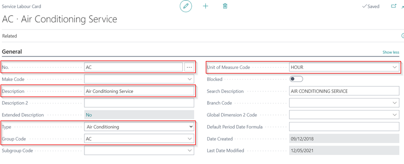

## In this article
1. [Creating a labour card](#creating-a-labour-card)
2. [Using Standard Times](#using-standard-times)

### Creating a labour card
To create a new **Labour Card**:
1. Select **Catalogues** from the role centre, then **Labours**.
2. Select **New** from the actions bar to create a new labour card and start entering the labour details.

The labour card is divided into the following FastTabs:

#### General
Fill in the following details:
1. **No.** - This is the unique code for the labour in the system. Create one without spaces and with no more than 20 characters.
2. **Description** - This is the labour description that will appear on the jobsheet/invoice.
3. **Type** - This is the type of labour; choose from the system's predefined list.
4. **Group Code**  - This is the Service Labour Group Code, which categorises the labour cards in the system.
5. **Unit of Measure Code** - This is the unit of measurement for labour; choose **HOUR**.

#### Invoicing
Fill in the following details:
 1. **VAT Bus. Posting Gr. (Price)** - This is the VAT Business Posting Group Specification for the labour. Select from the pre-defined list. Most of the time it’s set to **DOMESTIC**.
 2. **Unit Price** -  This is the selling price of the labour, and you can set a price for selling this labour each time it is sold.
 3. **Price/Profit Calculation** - This is the formula used for **Price** and **Profit**. Select **Profit=Price-Cost**.
 4. **Profit %** - This is the percentage Profit for the labour. Set it as **100%**.
 5. **Gen Prod. Posting Group** - This is the General Product Posting Group for the labour. Select from the pre-defined list. Most of the time it’s set to **LAB**.
 6. **VAT Prod. Posting Group** - This is the VAT Product Posting Group Specification for the labour. Select from the pre-defined list. Most of the time it’s set to **STANDARD**.



You can create as many customised labour cards as you want.

### Using Standard Times
**Standard Times** are the recommended labour hours for completing a certain job. They are used to determine how many labour hours to charge customers. To add **Standard Times** in the labour card:
1. Select **Related** from the actions bar, then **Labour**, and lastly **Standard Times**.

   

2. Set the **Standard Time** to be used for the labour. Using the **Make**, **Model**, and **Production Years** for the vehicle, you can add several **Standard Times**.

   

3. When you add the labour in the Jobsheet, the **Standard Time** is used, of which it can be changed from the **Quantity** field. The **Standard Time (Hours)** column is available for comparison (if not available you can add it by personalising).

   

4. If there are several **Standard Times** available, a pop-up appears with the preset **Standard Times**, and you can choose the relevant one.

 

### **See Also**

[Creating an Item Card](garagehive-create-an-item-card.html)
[Creating Service Packages](/docs/garagehive-service-packages.html "Creating Service Packages in Garage Hive")
