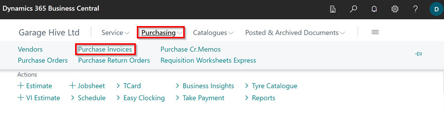
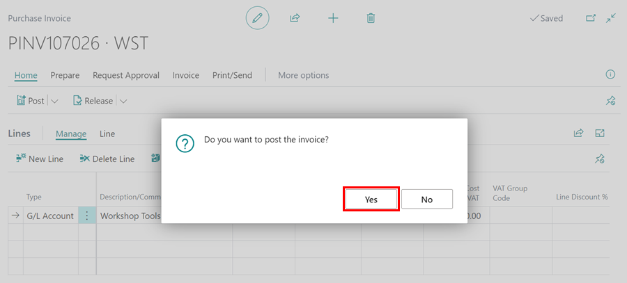

# Create a Purchase Invoice

### Why Purchase Invoice and not Purchase Order?  



Purchase Invoices are used when you do not require the item which is being purchased to be linked with a jobsheet. 

i.e. A workshop tool, via a Purchase Invoice this can be posted directly to the relevant G/L Account.  

Also, Purchase Invoices can used for any bills coming into the business. 

i.e. Tyre Disposal Invoices, Utility Bills etc.  

Within the home screen select **Purchasing** followed by **Purchase Invoices**   

Then select **+new**

A.  **No.** - This is pre populated when you select a Vendor Name. 

B.  **Vendor Name** - Choose your Vendor Name  

C.  **Vendor Invoice No.** - Input the Vendoe Invoice Number here. 

Fill in the lines 

**Type**    - Choose relevant type 

        -   G/L Account
        -   Item 
        -   Fixed Asset 
        -   Charge (Item) 
        -   External Service 

**No.** - Input Part number/ G/L Acount etc.

**Description/Comment** - Type what you will want to appear on the purchase invoice. 

**Location Code** - This will usually be **MAIN**. If you are part of a multi branch ensure correct Branch is selected. 

**Quantity** - Fill in quantity as per your supplier invoice. 

**Unit of Measure Code**    - Select relevant Unit of Measure. 

**Direct Unit Cost Incl. VAT** - Insert cost to us including VAT (This can be changes not to include VAT within the Vendor Card) 

When you are happy that the cost within the Purchase Invoices matches your Vendor Invoice, check the document date matches the invoice and posting date is correct.

Within the Action Bar, Select **Posting** followed by **Post** 

Then Select Yes to Do you want to post the invoice. 

This will be your Purchase Invoice processed.  

#   See Also

 [Create a Vendor Card](/docs/garagehive-create-a-vendor-card.html "Create a Vendor Card") 
