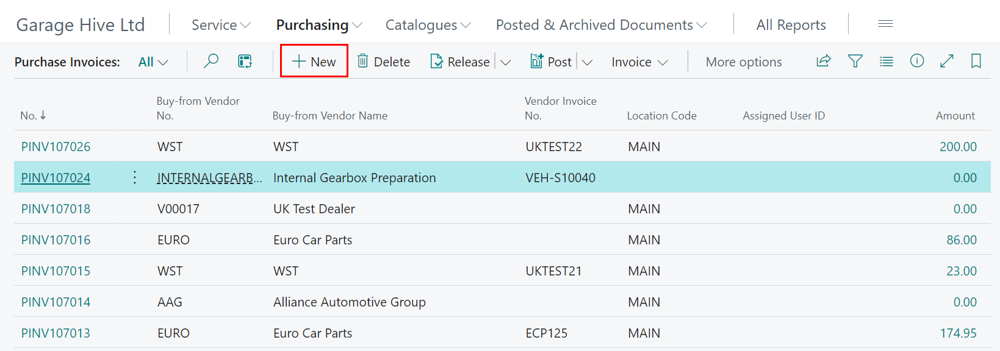
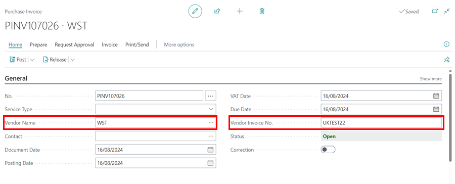
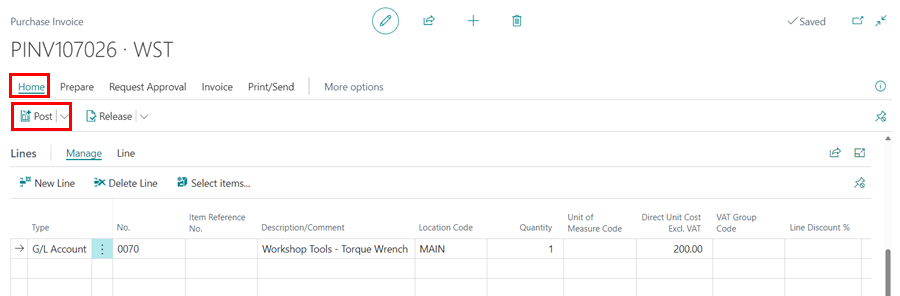

# How to Create a Purchase Invoice in Garage Hive
In this article, we'll first address the question: why opt for a **Purchase Invoice** instead of a **Purchase Order**? The most straightforward reason is that Purchase Invoices are used when the purchased item doesn't need to be associated with a Jobsheet. 

For example, if you need to purchase a workshop tool for use in your garage, you'll create a Purchase Invoice, allowing it to be posted directly to the relevant General Ledger (G/L) Account. 

Purchase Invoices are also suitable for handling any incoming bills, such as tyre disposal invoices, utility bills, and similar expenses.

To create a **Purchase Invoice:**
1. From the Role Centre/Home Screen, select **Purchasing** followed by **Purchase Invoices.**   

   

2. In the **Purchase Invoices** list, select **New** to create a new a Purchase Invoice.

   

3. Select the **Vendor Name**, and enter the **Vendor Invoice No.**.

   

4. In the **Lines** sub-page, fill in the details of what to purchase. 
   - **Type:** Choose relevant type.
     - G/L Account
     - Item
     - Fixed Asset
     - Charge (Item)
     - External Service 
   - **No.** - Input Part number/ G/L Account etc.
   - **Description/Comment** - Type what you will want to appear on the purchase invoice.
   - **Location Code** - This will usually be **MAIN**. If you are part of a multi branch ensure correct Branch is selected.
   - **Quantity** - Fill in quantity as per your supplier invoice.
   - **Unit of Measure Code** - Select relevant Unit of Measure.
   - **Direct Unit Cost Incl. VAT** - Insert cost to use including VAT (This can be changed not to include VAT within the Vendor Card). 

   

5. Once you confirm that the vendor invoice's cost and document date matches with those on the **Purchase Invoice** and that the posting date is correct, select **Home**, followed by **Post** from the menu bar.

   

6. After that, select **Yes** when prompted *Do you want to post the invoice?* 

   

7. The purchase will now be posted and recorded in the system.  

[Go back to top](#top)

### See Also 

[Create a Vendor Card](/docs/garagehive-create-a-vendor-card.html "Create a Vendor Card"){:target="_blank"} 
