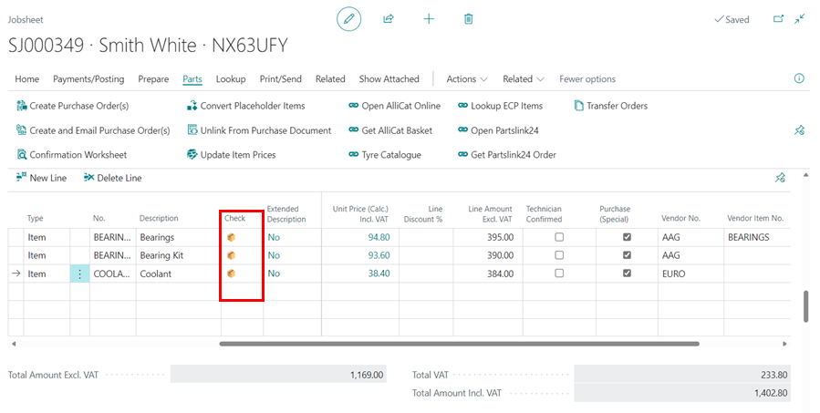
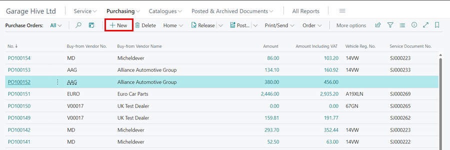

# How to Create and Use Purchase Orders in Garage Hive
Purchase Orders are commonly used in Business-to-Business (B2B) transactions to simplify the procurement process and provide a clear record of the transactions. In this article, we will look at how to create and use Purchase Orders in Garage Hive.

## In this article
1. [Creating a Purchase Order Directly from a Document](#creating-a-purchase-order-directly-from-a-document)
2. [Creating a Purchase Order from a Document Confirmation Worksheet](#creating-a-purchase-order-from-a-document-confirmation-worksheet)
3. [Create and Email the Purchase Order from a Jobsheet](#create-and-email-the-purchase-order-from-a-jobsheet)
4. [Creating a Purchase Order From the Role Centre](#creating-a-purchase-order-from-the-role-centre)
5. [Receive Items Without an Invoice](#receive-items-without-an-invoice)
6. [How to Split a Purchase Order Across Multiple Invoices](#how-to-split-a-purchase-order-across-multiple-invoices)
7. [Undo Receipt on Received Items](#undo-receipt-on-received-items)
8. [Available Price Columns in Purchase Orders](#available-price-columns-in-purchase-orders)

### Creating a Purchase Order Directly from a Document
To create a purchase order directly from a document (Such as a Jobsheet, Estimate or a VI Estimate):
1. Open the relevant document and scroll down to the **Lines** FastTab.
1. Select the **Type** column as **Item** and, if you know the part number or the item is in stock, start typing the part number or description in the **No.** column. 
1. Use a **Placeholder Item** number, such as **MISC**, for items that you don't know the part number. This will be the placeholder part number until you receive the items.
1. Enter the quantity to be ordered in the **Quantity** column.

   

1. Select the **Purchase (Special)** checkbox column on all item lines that need to be ordered, even if they are from different suppliers.
1. Enter the supplier name to order from in the **Vendor No.** column. If there are several parts from the same supplier, enter the same supplier in all the item lines.
1. If, on the other hand, some items are from a different supplier, enter the relevant supplier name in the **Vendor No.** column. This will ensure that separate Purchase Orders are created for each supplier.
   
   

1. Select **Parts** from the menu bar, then **Create Purchase Order(s)**. The purchase order will be created and its number will be indicated on the alert. If several suppliers are selected, an alert will be shown for each supplier.

   

1. The Purchase Order(s) have now been created and are ready for the parts to be ordered. Click on the **Special Order Purchase No.** to open the Purchase Order. 
   
   

1. When you receive and post the Purchase Order for parts ordered from a Jobsheet, the **Check** column  in the Jobsheet line is updated with a parcel icon (📦) to indicate that the items have been received as ordered.

   

1. Click on the parcel icon, to open the **Posted Purchase Receipt** of the part.
1. If the vendor selected does not have the items, or there is a problem ordering, you can unlink the document from the purchase order by selecting the **Unlink From Purchase Document** action under **Parts** in the menu bar, allowing you to create a new purchase order with a different supplier.

   

1. Delete the lines from the previously created purchase order(s).

[Go back to top](#top)

### Creating a Purchase Order from a Document Confirmation Worksheet
When creating a Purchase Order from a document (Jobsheet, Estimate and VI Estimate), there is also the option of using the **Confirmation Worksheet**:
1. Select **Parts** from the menu bar, then **Confirmation Worksheet**. 

   

2. A page with all of the parts added in the Jobsheet lines opens (excluding the labour). Select the **Purchase (Special)** checkbox column on all item lines that need to be ordered on the **Parts Order Confirmation** page and enter the **Vendor No.**.
3. Select **Create Purchase Order(s)** from the menu bar when done. The Purchase Order(s) has now been created and is ready for the parts to be ordered.

   

[Go back to top](#top)

### Create and Email the Purchase Order from a Jobsheet
Instead of simply creating a Purchase Order from the Jobsheet, you may want to create the Purchase Order and email it to the Vendor:
1. Ensure that the **Purchase (Special)** checkbox column is selected for the items you want to order, and that the Vendor is chosen in the **Vendor No.** column.
2. Select **Parts** from the menu bar, then the **Create and Email Purchase Order(s)** action to create and email the Purchase Order(s).

    

3. In the prompt 'Do you want to send e-mail?' select **Yes**.

    

4. In the following prompt, select the document sending profile. This profile consists of predefined rules and settings that determine the document sending process to the vendor. Click **OK**.

   

5. In the following window, compose the email in the **Message** field, enter the email address to send to in the **To** field, and when finished, click the **Send Email** action.

   

[Go back to top](#top)

### Creating a Purchase Order from the Role Centre
Use this option when ordering parts not linked to a specific document, such as stock items. To create a Purchase Order from the home screen, follow these steps:
1. From the home screen, select **Purchasing**, then choose **Purchase Orders** from the navigation menu.

   

2. On the **Purchase Orders** list page, click New.

   

3. Start typing the vendor name in the **Vendor No.** field, and select from the list. If the vendor is not available in the system you can [create a new vendor card](garagehive-create-a-vendor-card.html){:target="_blank"}.

   

4. Scroll down to the **Lines** FastTab and add the items from the supplier invoice. Select Item in the **Type** column and enter the part number in the **No.** column. If the item is not listed, you can [new create an item card](garagehive-create-an-item-card.html){:target="_blank"}.

   

5. To link the purchase order to a Jobsheet, go to the **General** FastTab, locate the **Purch. Source Type** field, and select **Jobsheet**.
6. In the **Jobsheet No.** field, just below **Purch. Source Type**, select the appropriate Jobsheet.
7. From the menu bar, choose **Special Order**, then select **Add Item Lines to Jobsheet**.

   

8. When you receive the items from the vendor, enter the vendor invoice number in the **Vendor Invoice No.** field, and ensure that the document date matches the invoice they sent.

   

9. You can now post the Purchase Order by choosing **Home** and then **Post** from the menu bar.

   

[Go back to top](#top)

### Receive Items Without an Invoice
When the items are received in the garage, without an invoice it is possible to first receive them in the system and then when you get an invoice you post them using the invoice. To receive the items first:
1. Open the purchase order with the items to be received. 
2. Under the **Lines** FastTab, in the **Qty. to Receive** column, delete the quantity for the items yet to be received and leave only the quantity for the items to receive.
3. In the menu bar, select **Home** and then **Post**.

   

4. Select **Receive** from the pop-up notification and click **OK**.

   

5. The items that have been received will be added to the **Quantity Received** Column.

   

6. After receiving the invoice, select **Receive and Invoice** for all items or **Invoice** for items already received and click **OK**.

   

[Go back to top](#top)

### How to Split a Purchase Order Across Multiple Invoices
In some cases, the items listed in a Purchase Order (PO) may be delivered through several invoices. Here's how to effectively manage and process a Purchase Order with multiple invoices:
1. Open the Purchase Order containing the items to be received.
2. Adjust the **Qty. to Receive** column by removing the quantity of any items that are associated with a different invoice (or have not yet been invoiced).

   

3. Enter the date of the invoice in the **Document Date** field, ensure that the **Posting Date** is accurate, and enter the Invoice No. in the **Vendor Invoice No.** field.

   

4. Select **Home** and then **Post** from the menu bar.

   

5. In the pop-up notification, select **Receive and Invoice** to receive and invoice the items in the vendor invoice that you have received.

   

6. The quantities in the **Quantity Received** and **Quantity Invoiced** columns will be updated accordingly for the items included in the invoice. Items associated with other invoices will remain in the **Qty. to Receive** and **Qty. to Invoice** columns, keeping the Purchase Order open.

   

7. Repeat this process for each remaining invoice(s), ensuring you accurately enter the **Document Date**, **Posting Date**, and **Vendor Invoice Number** for each one. 
8. Once all items have been received and invoiced, the Purchase Order will be fully closed and posted, and will no longer appear in the purchase order list.

[Go back to top](#top)

### Undo Receipt on Received Items
When you receive items from a Purchase Order but need to reverse the receipt, here is the process: 
1. Open the Purchase Order that includes the received items and is still in an open status.
2. In the menu bar, select **Order**, then choose **Receipts**.

   

3. To open the receipt, click on the receipt's **No.**.

   

4. Then, in the **Receipt**, scroll down to the **Lines** FastTab, select **Functions**, and then **Undo Receipt**.

   

[Go back to top](#top)

### Available Price Columns in Purchase Orders
The following price columns are available in the Purchase Order to indicate the various prices for the item as explained below:
1. **Direct Unit Cost** - The price at which the item is purchased from the supplier.
2. **Line Amount** - The total amount for all items in that specific line to be purchased from the supplier.
3. **Item Card Unit Price** - The unit sales price of the item as shown on the Item Card.
4. **Sales Doc. Unit Price** - The unit sales price of the item as displayed on the linked sales document.

   

[Go back to top](#top)

 

### **See Also**

[Video: How to Create Purchase Orders in Garage Hive](https://www.youtube.com/watch?v=CxgRuv8eTT4){:target="_blank"}

