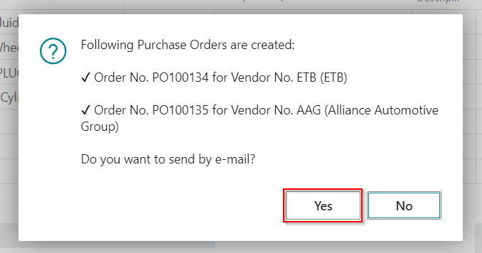
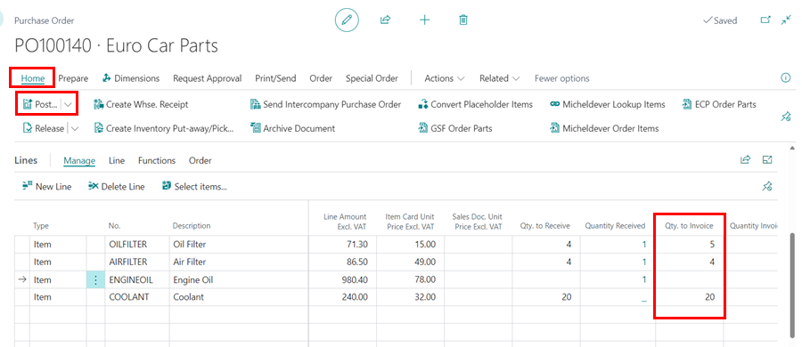
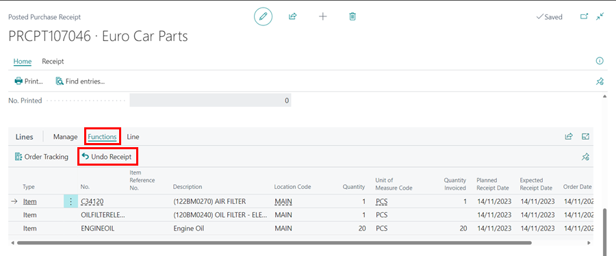

# How to Create and Use Purchase Orders in Garage Hive
Purchase Orders are commonly used in Business-to-Business (B2B) transactions to simplify the procurement process and provide a clear record of the transactions. In this article, we will look at how to create and use Purchase Orders in Garage Hive.

## In this article
1. [Creating a Purchase Order Directly from a Jobsheet](#creating-a-purchase-order-directly-from-a-jobsheet)
2. [Create and Email the Purchase Order from a Jobsheet](#create-and-email-the-purchase-order-from-a-jobsheet)
3. [Creating a Purchase Order From the Role Centre](#creating-a-purchase-order-from-the-role-centre)
4. [Receive Items Without an Invoice](#receive-items-without-an-invoice)
5. [How to Split a Purchase Order Across Multiple Invoices](#how-to-split-a-purchase-order-across-multiple-invoices)
6. [Undo Receipt on Received Items](#undo-receipt-on-received-items)
7. [Available Price Columns in Purchase Orders](#available-price-columns-in-purchase-orders)

### Creating a Purchase Order directly from a Jobsheet
To create a purchase order directly from a Jobsheet:
 

**Option 1**
1. Open the relevant Jobsheet and scroll down to the **Lines** FastTab.
1. Select the **Type** column as **Item** and, if you know the part number or the item is in stock, start typing the part number or description in the **No.** column. 
1. Use a **Placeholder Item** number, such as **MISC**, for items that you don't know the part number. This will be the placeholder part number until you receive the items.
1. Enter the quantity to be ordered in the **Quantity** column.

   

2. Enter the supplier name to order from in the **Vendor No.** column. If there are several parts from the same supplier, enter the same supplier in all the item lines.
3. If, on the other hand, some items are from a different supplier, enter the relevant supplier name in the **Vendor No.** column. This will ensure that separate Purchase Orders are created for each supplier.
4. Select the **Purchase (Special)** checkbox column on all item lines that need to be ordered, even if they are from different suppliers.
   
   

5. Select **Parts** from the menu bar, then **Create Purchase Order(s)**. The purchase order will be created and its number will be indicated on the alert. If several suppliers are selected, an alert will be shown for each supplier.

   

6. The Purchase Order(s) have now been created and are ready for the parts to be ordered. The next step will be to receive the parts and post the Purchase Order.
   
   

7. When you receive and post the Purchase Order for parts ordered from a Jobsheet, the **Check** column  in the Jobsheet line is updated with a parcel icon (📦) to indicate that the items have been received as ordered.

   

8. Click on the parcel icon, to open the **Posted Purchase Receipt** of the part.

   

9. If the vendor selected does not have the items, or there is a problem ordering, you can unlink the Jobsheet from the purchase order by selecting the **Unlink From Purchase Document** action under **Parts** in the menu bar, allowing you to create a new purchase order with a different supplier.
10. Delete the lines from the previously created purchase order(s).

   

[Go back to top](#top)

**Option 2**
When creating a Purchase Order directly from the Jobsheet, you also have the option of using the action **Confirmation Worksheet**:
1. Select **Parts** from the menu bar, then **Confirmation Worksheet**. A page with all of the parts added in the Jobsheet lines opens (excluding the labour).
2. Select the **Purchase (Special)** checkbox column on all item lines that need to be ordered on the **Parts Order Confirmation** page and enter the **Vendor No.**.
3. Select **Create Purchase Order(s)** from the menu bar when done. The Purchase Order(s) has now been created and is ready for the parts to be ordered.

   

[Go back to top](#top)

### Create and Email the Purchase Order from a Jobsheet
Instead of simply creating a Purchase Order from the Jobsheet, you may want to create the Purchase Order and email it to the Vendor:
1. Ensure that the **Purchase (Special)** checkbox column is selected for the items you want to order, and that the Vendor is chosen in the **Vendor No.** column.

    

2. Select **Parts** from the menu bar, then the **Create and Email Purchase Order(s)** action to create and email the Purchase Order(s).

    

3. In the prompt 'Do you want to send e-mail?' select **Yes**.

    

4. Select the option to use to select the document sending profile in the next prompt. Document sending profile includes predefined rules and settings that dictate how the documents are sent. Click **OK**. 

   

5. In the following window, compose the email in the **Message** field, enter the email address to send to in the **To** field, and when finished, click the **Send Email** action.

   

[Go back to top](#top)

### Creating a Purchase Order from the role centre
This option is typically used only after the invoice has been received from the supplier. To create a Purchase Order from the home screen:
1. Select **Purchasing**, and then **Purchase Orders** from the navigation menu in the home screen.
2. Choose **New** from the **Purchase Orders** page.
3. Start typing the vendor name in the **Vendor No.** field, and select from the list. If the vendor is not available in the system you can [create a new vendor card](garagehive-create-a-vendor-card.html){:target="_blank"}.
4. In the **General** FastTab, enter the invoice number in the **Vendor Invoice No.** field.

   

5. Scroll down to the **Lines** FastTab and add the items from the supplier invoice by selecting **Item** in the **Type** column and entering the part number in the **No.** column, or [create an item card](garagehive-create-an-item-card.html){:target="_blank"} for items not in stock list.

   

6. If you want to link the purchase order to a jobsheet, go to the **General** FastTab, then to the **Purch. Source Type** field, and choose **Jobsheet.**
7. Select the Jobsheet to link to in the **Jobsheet No.** field, which is located below the **Purch. Source Type** field.
8. Select **Special Order** from the menu bar, followed by **Add Item Lines to Jobsheet** action.

   

9. You can now post the Purchase Order by choosing **Posting** and then **Post** from the menu bar.

   

[Go back to top](#top)

### Create and Email the Purchase Order from a Jobsheet

[Go back to top](#top)

### Receive Items Without an Invoice
When the items are received in the garage, without an invoice it is possible to first receive them in the system and then when you get an invoice you post them using the invoice. To receive the items first:
1. Open the purchase order with the items to be received. 
2. Under the **Lines** FastTab, in the **Qty. to Receive** column, delete the quantity for the items yet to be received and leave only the quantity for the items to receive.

   

3. In the menu bar, select **Posting** and then **Post**.

   

4. Select **Receive** from the pop-up notification and click **OK**.

   

5. The items that have been received will be added to the **Quantity Received** Column.

   

6. After receiving the invoice, select **Receive and Invoice** for all items or **Invoice** for items already received and click **OK**.

   

[Go back to top](#top)

### How to Split a Purchase Order Across Multiple Invoices
At times, it's possible that the items listed in a Purchase Order will be delivered through multiple invoices. Here is how to effectively process the Purchase Order with the multiple invoices:
1. Open the Purchase Order with the items to be received.
2. Delete from the **Qty. to Receive** column, the quantity of the item that has a different invoice (or the invoice has yet to be received).

   

3. Enter the date of the invoice in the **Document Date** field, ensure that the **Posting Date** is accurate, and enter the Invoice No. in the **Vendor Invoice No.** field.

   

4. Select **Posting** and then **Post** from the menu bar.

   

5. In the pop-up notification, select **Receive and Invoice** to receive and invoice the items in the vendor invoice that you have received.

   

6. The **Quantity Received** and **Quantity Invoiced** columns of the items in the invoice are filled with the respective quantities. However, for the other items in other invoices, their quantities are still displayed in the **Qty. to Receive** and **Qty. to Invoice** columns, as the Purchase Order is still open.

   

7. Repeat the procedure for all the remaining invoices, making sure to enter the correct **Document Date**, **Posting Date**, and **Vendor Invoice Number** for each invoice. 
8. After all the Items have been received and invoiced, the purchase order will be fully closed and posted, and will no longer be visible in the purchase order list.

   

[Go back to top](#top)

### Undo Receipt on Received Items
1. When you receive items from a Purchase Order but need to reverse the receipt. Open the Purchase Order with the items you've just received.
2. In the menu bar, select **Navigate** and then **Receipts**.

   

3. To open the receipt, click on the receipt's **No.**.

   

4. Then, in the **Receipt**, scroll down to the **Lines** FastTab, select **Functions**, and then **Undo Receipt**.

   

### Available Price Columns in Purchase Orders
The following price columns are available in the Purchase Order to indicate the various prices for the item as explained below:
1. **Direct Unit Cost** - This is the cost of the item as purchased from the supplier.
2. **Line Amount** - This is the total amount for all items in the line to be purchased from the supplier.
3. **Item Card Unit Price** - This is the unit sales price for the item as it appears on the Item Card.
4. **Sales Doc. Unit Price** - This is the unit sales price for the item as it appears on the linked sales document.

   

[Go back to top](#top)

 

### **See Also**

[Video: How to Create Purchase Orders in Garage Hive](https://www.youtube.com/watch?v=CxgRuv8eTT4){:target="_blank"}

