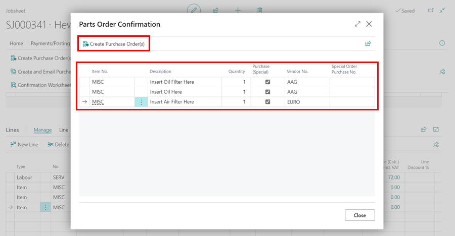

# Create a Purchase Order

There are 2 ways of creating a purchase order, either directly from a jobsheet or from the home screen and link to jobsheet if required.   

##### First Method Creating a Purchase Order direct from a jobsheet. 

1. Open relevant jobsheet and scroll down to lines and select Item.

2. Select Item. If you know the part number or it is an item from stock you can. Start typing description/start of part number into the No. box and it will show a list of all items with that in description in it. 

If you do not know the part number of the item you are ordering then type ‘MISC’ into the No. box, this will be a placeholder part until you receive the item.

   
Select required quantity to be ordered

In the vendor column type in the beginning of the suppliers name/vendor number and select from the list. If there are multiple parts from the same supplier put their information in each box.

* You can create multiple purchase orders for different suppliers by select the relevant supplier in the vendor column against the specific parts.

* Place a tick in the  ‘Purchase (Special)’ box column against all parts you need to order. Even if they are from different suppliers tick all boxes and separate Purchase Order numbers will be created for each vendor you have specified.

* Within the Actions Bar select Parts, followed by 'Create a Purchase Order(s)’.

It will then alert that a purchase order has been created. If multiple suppliers have been selected this will bring an alert up for each supplier. You can take note of the purchase order numbers here.

***THE PURCHASE ORDER HAS NOW BEEN RAISED AND READY FOR THE PARTS TO BE ORDERED 
THE NEXT STEP WILL BE TO RECEIVE THE PARTS INTO STOCK AND POST THE PURCHASE ORDER***

##### Second Method Creating a Purchase Order to link to a jobsheet. 
(This option is usually only used once the invoice has been received from the supplier)

Within the Actions Bar on the Home screen, 

*   Fill in your Vendors Details. 

This will populate you a purchase order 

*   Complete the Jobsheet number which you wish to link the parts onto. 

*   Then select Add Item Lines to Jobsheet. 

At this point you now post this purchase order and bring the parts into stock. 

