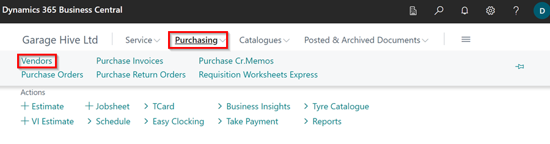
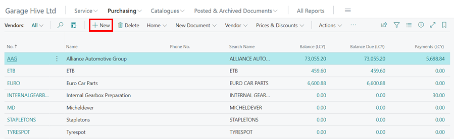
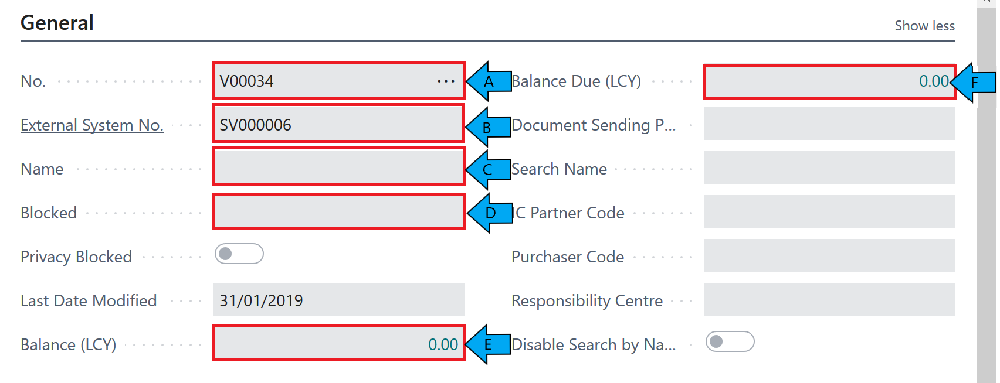
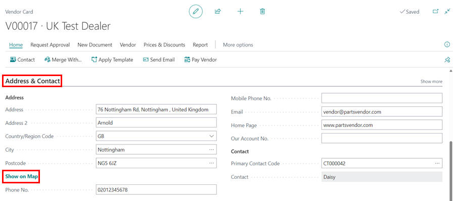
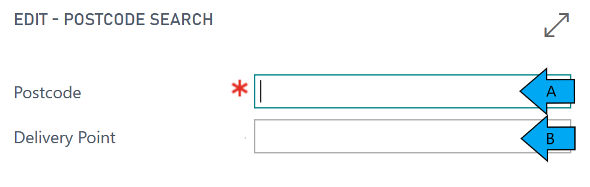
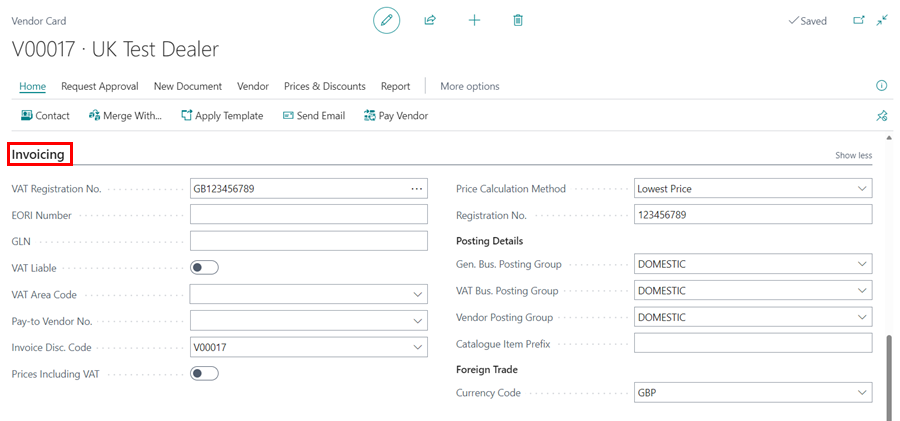
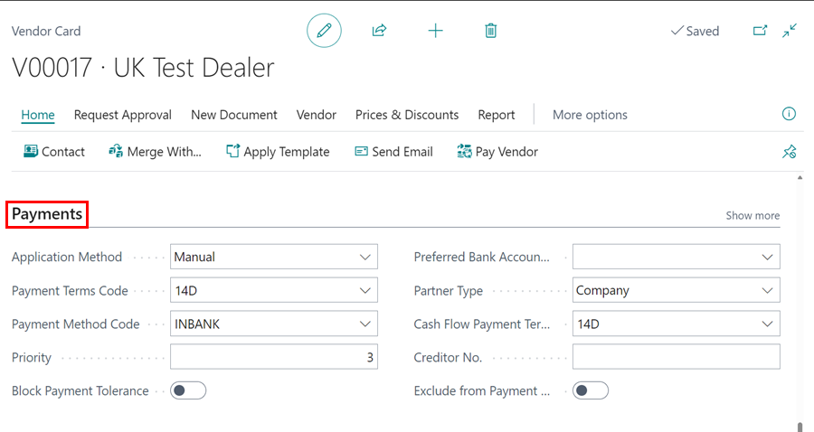

#   Create a Vendor Card

Within the Home Screen Select **Purchasing**

Then Select **Vendors** 

Then Select + new 

#   You will now be able to start building the Vendor Card. 

####    The Vendor Card is split down into several sub-categories. 

##  GENERAL 

A.  **No. (Sell to Customer)** - Give the Vendor a unique Vendor number.  

B.  **External System No.** - If you are using a external accountancy system, place your accountancy system number for the vendor here. 

C.  **Name** 

D.  **Blocked** - If you want to block a vendor to prevent ordering from them select **All**.  

E.  **Balance (LCY)**

F.  **Balance Due (LCY)** 

##  ADDRESS & CONTACT 

Select Lookup Address button.

A.  **Postcode** - Complete Postcode. 

B.  **Building No.** - You can either put the building no. in or leave this blank.  *If you leave this blank it will show all addresses within that postcode.** 

**Address** - If you have used the Lookup Address, this will automatically be completed. If not you can complete manually. 

**Phone No.** - Complete landline contact number, *(if available*).

**Email** - Fill in Email information - This will allow you to email documents such as Invoices/Proforma/Vehicle Health Checks etc. 

##  INVOICING 

A. **VAT Registration No.** - Fill in the Vendor's VAT Registration Number. 

B.  **Prices Including VAT** - If this is selected any purchase orders for this Vendor will always calculate prices including VAT. 

C.  **Gen. Bus. Posting Group** - These are pre-defined fields to select from. 

**DO NOT Create your own without discussing with a member of the Support Team.**  

D.  **VAT Bus. Posting Group** - These are pre-defined fields to select from. 

**DO NOT Create your own without discussing with a member of the Support Team.**  

Please note that the majority of the time this should be set up as **DOMESTIC.**

E.  **Vendor Posting Group** - These are pre-defined fields to select from. 

**DO NOT Create your own without discussing with a member of the Support Team.**  

Please note that the majority of the time this should be set up as **DOMESTIC.**

F.  **Nonstock Item Prefix** - If you have a nonstock profile for this Vendor, if you put a prefix here this will show in front of the part number when you bring it into stock.  

##  PAYMENTS

**Application Method** - Specific how to apply payments to entries for this Vendor. 

**Payment Terms Code** - Specifies a formula that calculates the payment due date.  

**Payment Method Code** - Specifies how to make a payment, such as with bank transfers, cash or cheque. 

**Priority** - Specifies the importance of the vendor when suggesting payments using the Suggest Payments function. 

**Block Payment Tolerance** - Specifies if the vendor allows payment tolerance.  

**Preferred Bank Account** - Specifies the vendor bank account that will be used by default on the payment journal lines for export to a payment bank file. 

**Partner Type** - Specifies if a Vendor is a person or company. 

**Cash Flow Payment Terms** - Specifies a payment term that will be used for calculating cash flow. 

The Vendor Card can be edited by selecting the ✏ button within the Action Bar. 

This is your Vendor Card created. 

