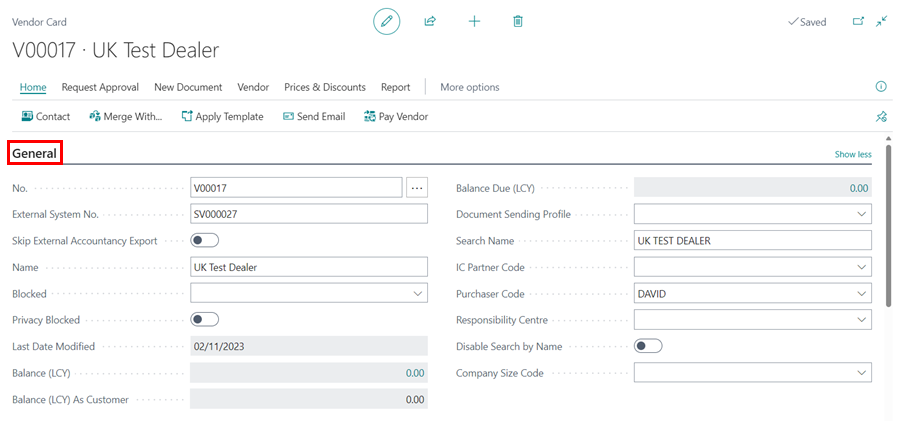

# How to Create a Vendor Card in Garage Hive 
In Garage Hive, a Vendor card is used to store all the relevant information about a vendor or supplier. This includes their name, address, phone number, email address, payment and invoicing details, and any other relevant information. You can easily create a Vendor card from the Role Centre or the Home Screen.

## Creating a Vendor Card From the Role Centre
1. From the Role Centre, select **Purchasing**, followed by **Vendors**.

   

2. Click on **New** in the vendor list that opens. 

   

3. A new Vendor card will now be created, and you can start adding details about the Vendor.

## Vendor Card Details Sections
The Vendor card is divided into several sub-categories, as listed below:

#### 1. General Information
In the **General** section, you can add or view general Vendor details, such as the **Name**, assigned **No.** in the system, **External System No.**, **Balance Due(LCY)**, whether they are **Blocked** or not, among other general information about the Vendor. Click on **Show More/less** in the top right of the **General** section, to reveal more fields or hide some of the fields. 

   

#### 2. Address & Contact
The Vendor's address and contact details are contained in this section. After entering the address details, you can select **Show on Map** to view the exact location on maps.

   

#### 3. Invoicing
In the **Invoicing** section, the posting details of the Vendor are added here. 

   

   - **VAT Registration No.** - Fill in the Vendor's VAT Registration Number.
   - **Prices Including VAT** - If this is selected any purchase orders for this Vendor will always calculate prices including VAT.
   - **Gen. Bus. Posting Group** - These are pre-defined fields to select from.
   - **VAT Bus. Posting Group** - These are pre-defined fields to select from. Please note that the majority of the time this should be set up as **DOMESTIC.**
   - **Vendor Posting Group** - These are pre-defined fields to select from. Please note that the majority of the time this should be set up as **DOMESTIC.**
   - **Nonstock Item Prefix** - If you enter a prefix here for a non-stock item from this vendor, it will appear before the part number when it is brought into stock.

#### 4. Payments
In the **Payments** section, we have the application method, payment terms, payment method, and other related information about the vendor's payment.

   
   
   - **Application Method** - Specifies how to apply payments to entries for this Vendor.
   - **Payment Terms Code** - Specifies a formula that calculates the payment due date.
   - **Payment Method Code** - Specifies how to make a payment, such as with bank transfers, cash or cheque.
   - **Priority** - Specifies the importance of the vendor when suggesting payments using the Suggest Payments function.
   - **Block Payment Tolerance** - Specifies if the vendor allows payment tolerance.
   - **Preferred Bank Account** - Specifies the vendor bank account that will be used by default on the payment journal lines for export to a payment bank file.
   - **Partner Type** - Specifies if a Vendor is a person or company.
   - **Cash Flow Payment Terms** - Specifies a payment term that will be used for calculating cash flow.

[Go back to top](#top)

