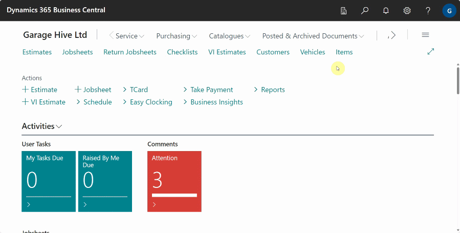
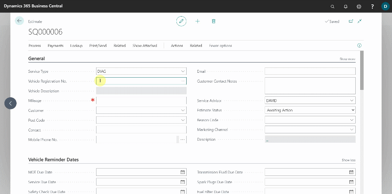
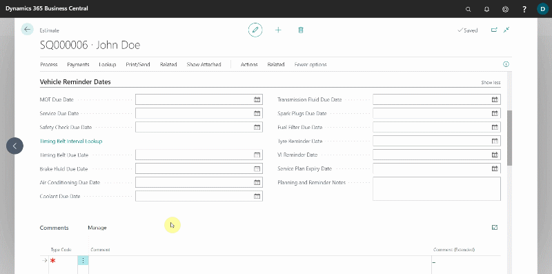
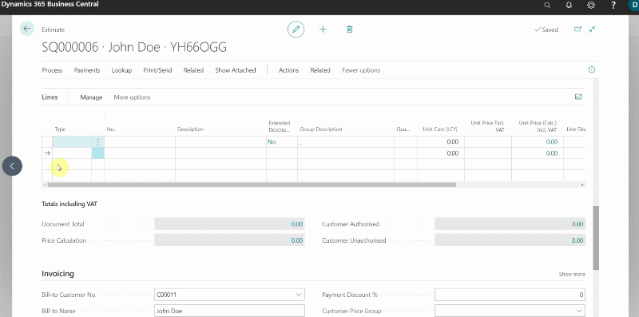
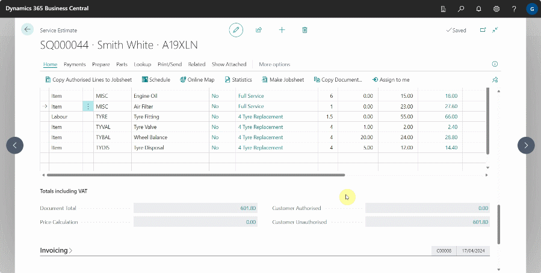
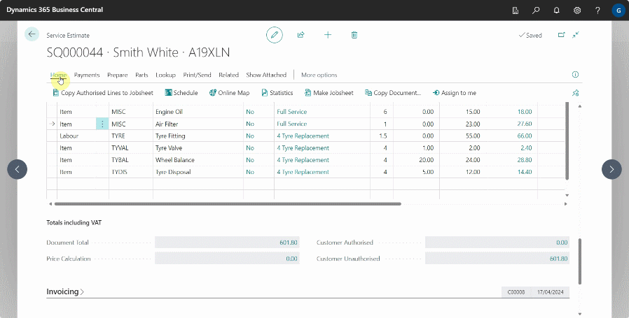

# Creating an Estimate 
To create a new Estimate:
1. Select **Estimates** in the Home Screen, and then choose **New.**
2. Select the **Service Type** - This is the type of job that you are quoting.

   

3. Fill in the **Vehicle Registration No.**:
    - If the vehicle is in the system, the customer card will be auto-filled.
    - If the vehicle is not in the system, the system will look it up using **VRM** to obtain the vehicle's details.

    

4. After the VRM lookup for the vehicle, enter the customer information:
    - If the customer's information was previously entered for another vehicle, the system will obtain the customer's information and link it to the vehicle.
    - If the customer is new to the system, the system will prompt you to [Create a new customer card](docs/garagehive-create-a-customer-card.html "Create Customer Card").
5. Fill in **Address & Contact** FastTab in the **Customer** card:
    - Select **Lookup Address from Postcode**, enter the **Postcode**, click **OK**, and then select the appropriate address.
    - Fill in the contact information, including phone numbers and email addresses.

         

6. You can enter any information the customer has provided about the estimate in the **Comments** section. 

   

7. Under the **Group Items** section, you create groups where you add lines based on job to be quoted. The groups help in the categorisation of the lines, for example you can create groups like **Full Service and MOT**, **Tyre Replacement** or other group items. Read more here [Grouping document lines](garagehive-group-items-grouping-document-lines.html){:target="_blank"}.

   

8. You can now begin adding **Labour** lines, **Items** lines, or **Service Packages** to the estimate:
    - **Type** column - Select either **Labour** or **Item** as the line.
    - **No** column - Enter the number for **Labour** or **Item**, in the system. For example, for item, you can use a placeholder item number, such as **MISC** for items you currently don't have in stock, **inventory items** like air filters and engine oil, **non-inventory items** like consumables, or **external services**, or other items; for labour, you can choose **service labour**, **standard labour**, or other labours.
    - **Description** column - This is the item or labour description that will appear in the customer's estimate.
    - **Quantity** column - Enter the quantity of items or hours to quote.
    - **Unit Cost** column - This is the cost of an item to the business. This field is left blank for labour.
    - **Unit Price** - This is the price at which the customer will buy the item or labour per unit.
    - **Unit Price (Calc) Incl. VAT** column - When you click on the amount in this field, a pop-up window will appear, showing the **Unit Price**, **Margin %**, **Unit Price Incl. VAT**, and **Total Incl. VAT**, allowing you to do price calculation.
    - **Line Discount %** column - If you'd like to apply a discount to the job, within this field, fill in the percentage discount.
    - **Line Discount Amount** column - This is the amount applied to the line as a discount. By default this column is not visible, but you can use [personalisation](garagehive-personalising-garage-hive.html){:target="_blank"} to add it.
    - **Line Amount Excl. VAT** - This is the pre-VAT total line amount.

      

9. If you click on any amount under the **Totals Including VAT** section, which is below the estimate lines, a pop-up window appears which shows the **Document Total**, **Price Calculation**, **Customer Authorised** totals and **Customer Unauthorised** totals.

   

### When the work in the estimate is authorised
You can either create a jobsheet with all of the items from the estimate added to it, which will close the estimate, or you can select specific lines from the estimate to add to an open jobsheet if one already exists. 
To convert the whole estimate into a jobsheet:
1. In the menu bar, select **Process**, then **Make Jobsheet**. This will convert your estimate into a jobsheet, which you can then use to [create an allocation for the job](garagehive-create-a-booking.html){:target="_blank"} in the schedule for the relevant day.

   

To Select partial lines from the estimate to add to an open Jobsheet:
1. From the estimate lines, tick the checkbox in **Customer Authorised** field, for all the lines that have been authorised by the customer.
2. Then, select **Process** from menu bar, followed by **Copy Authorised Lines to Jobsheet**, and select the jobsheet to which you want to copy the lines, and click **OK**. This will add the selected lines to the selected jobsheet.

   

[Go back to top](#top)
