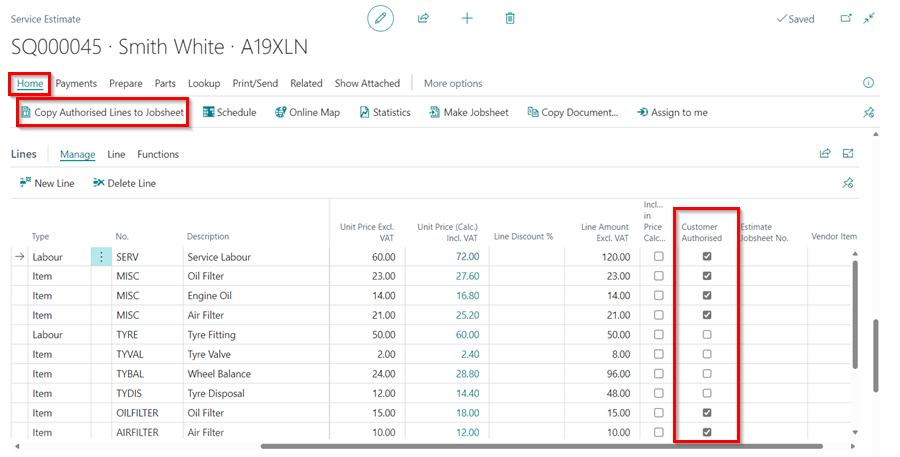

#   Creating an Estimate 

Select Estimates in the Home Screen, followed by + New

You can then start to create your estimate. 

A.  Select Service Type. 

B. Fill in Vehicle Registration No. 

*   If the vehicle has been in before it will fine the customer card. 

*   If the vehicle has not been in before it will find the vehicle using VRM.  
            - You will now need to fill in the Customer box.  
            - Type in the customers name how you would like to appear on the invoice. 
            

- If the customer has been in before with another vehicle. It will find the customer details. 

*   If customer has not been in before it will ask you to [Create a new customer card](docs/garagehive-create-a-customer-card.html "Create Customer Card").

*    Fill in this section with as much information as you require. 

        *   A.  Select "Lookup Address from Postcode".
        *   B.  Fill in postcode and select ok, then select relevant address. 
        *   C.  Fill in as much information in the contact section specifically contact numbers and email address. 

*   You can fill in comments box with any information the customer has supplied regarding the estimate. 

*   You can now start building the estimate by adding Labour Lines, Items, Service Packages.

*   Type - Select type - i.e. Labour, Item or External Service. 

*   No. - Select Labour Line, Item number or External Service type.

*  Description - Fill in the description as you would want it to show on the invoice. 

*   Quantity - Complete quantity.   

*   Unit Cost - This remains blank for Labour. This is the cost of an item to us. 

*  Unit Price - This is the cost we are charging the customer. 

*   Unit Price (Calc) Incl. VAT - You can add a % margin on the cost price by using this. If you click within this cell, it will open the following pop up for you to make your calculation. 

*   Line Discount - If you are wanting to add discount to a job. Complete the required % within this cell.

*   Line Amount Excl. VAT - This is the total line amount pre VAT. 

This is your estimate now built. 

####    If the work is authorised. 

You can either create a jobsheet with all of the items within the estimate added to it, this will in turn close down the estimate or alternatively, if there is a jobsheet already open you can select specific lines from the estimate to add to the open job. 

##### To convert the whole estimate into a jobsheet. 

You can create a completely new jobsheet by selecting Process followed by Make Jobsheet within the actions bar. 

This will then convert your estimate into a jobsheet number. Then go to the schedule to the relevant day and create an allocation by Select Existing Jobsheet. Search the Job number provided during the conversion or Registration number. 

######  Selecting partial lines from the estimate to add to an open jobsheet. 

Within the lines section of the Estimate, tick the customer authorised section to the lines which you wish to add onto the jobsheet. 

Then select Process within the Action Bar followed by Copy Authorized Lines to Jobsheet, which will add the selected lines to the open jobsheet. 

