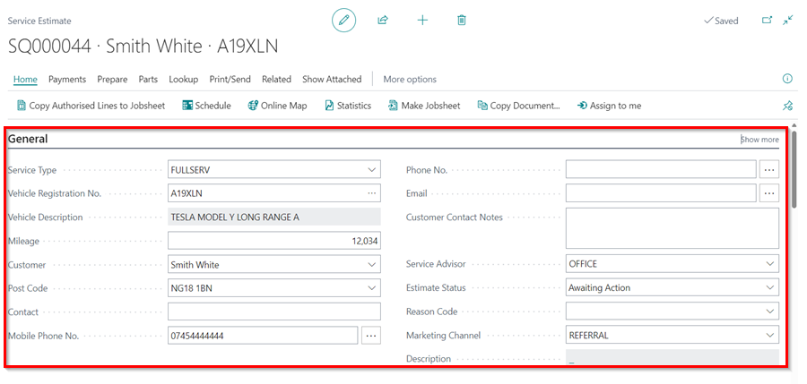
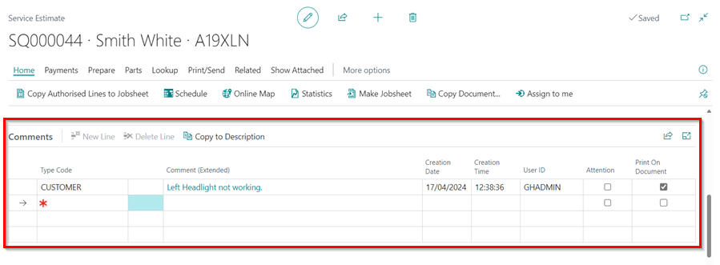

#   Creating an Estimate 

Select Estimates in the Home Screen. 

Select +new

You can then start to create your estimate. 

A.  Select Service Type. 

B. Fill in Vehicle Registration No. 

*   If the vehicle has been in before it will fine the customer card. 

*   If the vehicle has not been in before it will find the vehicle using VRM.  
            - You will now need to fill in the Customer box.  
            - Type in the customers name how you would like to appear on the invoice. 
            

- If the customer has been in before with another vehicle. It will find the customer details. 

*   If customer has not been in before it will ask you to [Create a new customer card](https://docs.garagehive.co.uk/docs/garagehive-create-a-customer-card.html "Create Customer Card").

*    Fill in this section with as much information as you require (Use Lookup Address Action in the ribbon for postcode search).

*   You can fill in comments box with any information the customer has supplied regarding the estimate. 

*   You can now start building the estimate by adding Labour Lines, Items, Service Packages.

*   Type - Select type - i.e. Labour, Item or External Service. 

*   No. - Select Labour Line, Item number or External Service type.

*  Description - Fill in the description as you would want it to show on the invoice. 

*   Quantity - Complete quantity.   

*   Unit Cost - This remains blank for Labour. This is the cost of an item to us. 

*  Unit Price - This is the cost we are charging the customer. 

*   Unit Price (Calc) Incl. VAT - You can add a % margin on the cost price by using this. If you click within this cell, it will open the following pop up for you to make your calculation. 

*   Line Discount - If you are wanting to add discount to a job. Complete the required % within this cell.

*   Line Amount Excl. VAT - This is the total line amount pre VAT. 

This is your estimate now built. 

####    If the work is authorised. 

*   Select Make Jobsheet button within the Ribbon. 

This will convert the Estimate number into a Job number. 

Then go to the schedule to the relevant day and create an allocation by Select Existing Jobsheet. Search the Job number provided during the conversion or Registration number. 

