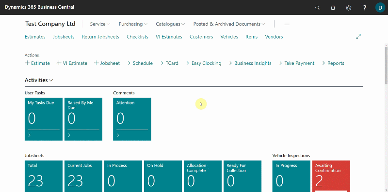
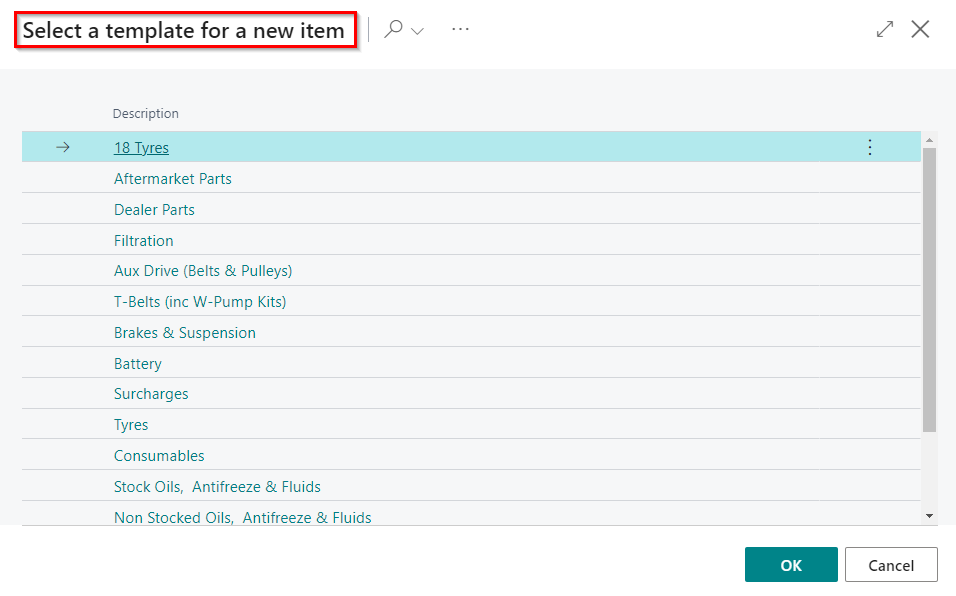
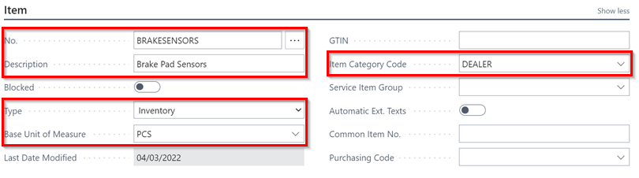
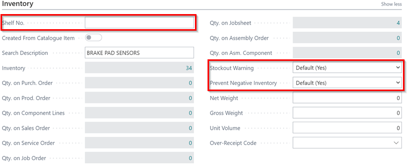
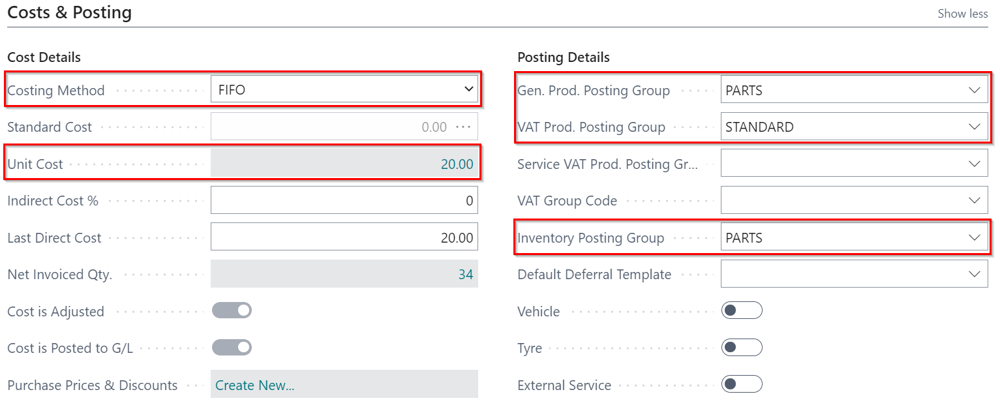
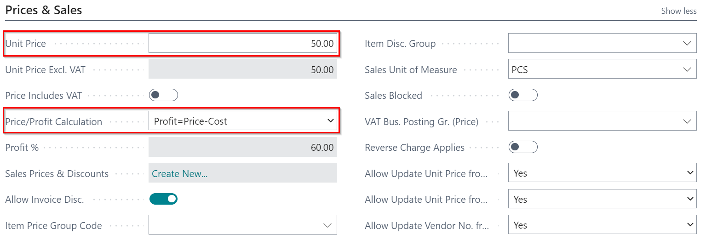
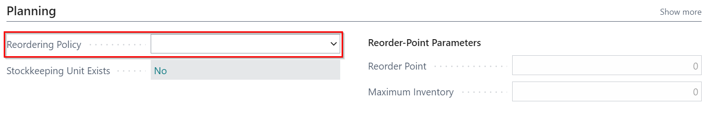

# Creating an Item Card
To create a new **Item Card:**
1. Select **Catalogues** in the Home Screen/Role Centre, and then choose **Items**.
2. Click on **New**, to create a new **Item Card.**

   

3. In the next window, select the most relevant **Template** for the item you wish to create, which pre-selects the **Item Category** within the item card.

   

The item card is split into the following FastTabs:

## Item
Fill in the following details:
1. **No.**  - This is the the part number of the item either from your supplier or the part number you wish to give a particular part. For example **BF** for Brake Fluid, **and so on.
2. **Description** - This is the description of the part. The description is what appears on the Jobsheet/invoice when printed for the customer. In the above example of brake fluid, the description will be **Brake Fluid.**
3. **Type** - This defines the type of the item card to create. You can select **Inventory** for parts to add in inventory, **Service** for services or **Non-Inventory** for non-inventory items.
4. **Base Unit of Measure** - Select the relevant unit of measure for the item. For example, **Brake Fluid** Unit of Measure = LTR (Litre), **Bulb** Unit of Measure = PCS (Piece), **Brake Pipe** Unit of Measure = MTR (Metre) and so on.
5. **Item Category Code** - This is the category for item which contain assigned item attributes, and it's pre-selected when choosing the item template for the item card.

   

## Inventory
Fill in the following details:
1. **Shelf No.** - This is the physical location of the part.
2. **Stockout Warning** - This is always set to **Default (Yes)**, to alert you if you try and sell something out which is not in stock but can be changed to **No** in certain scenarios. For example, in Non-inventory item like **Consumables** - when you want to add a Consumables Cost on your invoices rather than booking out specific parts each time.
3. **Prevent Negative Inventory** - This is set to **Default (Yes)**, to prevent you from selling something out you do not have in stock but can be changed to **No** in certain scenarios. For example, in Non-inventory item like **Consumables**.

   

## Cost & Posting
Fill in the following details:
1. **Costing Method** - This should be set to **FIFO** (First In First Out).
2. **Unit Cost** - This is the buying price of the part from the supplier, and will automatically be populated when receiving the part via the purchase order.
3. **Gen. Prod Posting Group** - This is the item's product type to link transactions made for this item with the appropriate general ledger account according to the general posting setup; select the appropriate group from the pre-defined list. 
4. **VAT Prod. Posting Group** - This is the VAT specification of the invoice item to link transactions made for this item with the appropriate general ledger account acording to the VAT posting setup; select from the pre-defined list. Most of the time it's set to **STANDARD**.
5. **Inventory Posting Group** - These are pre-defined fields to select from - Usually linked to the specific Item Category Code used.

   



## Prices and Sales
Fill in the following details:
1. **Unit Price**  - This is the selling price of the part, and you can set a price for selling this time every time it's sold.
2. **Price/Profit Calculation** - This is the calculation relationship among the **Price**, **Profit** and the **Cost** of the part, normally set to **Profit=Price-Cost.**

   

## Replenishment
No details should be added in this FastTab.

## Planning
Fill the following detail:
1. **Reordering Policy** - This is the method by which the **Item** should be reordered when it is almost out of stock; select **Maximum Qty** as the reordering policy and enter the **Reorder Point** as the quantity of items that when the item stock reaches it, the item is reordered. When the reordering policy is selected, the item won't appear in the [Items to return report](garagehive-items-to-return.html).

   

## Item Tracking
No details should be added in this FastTab.

## Warehouse
No details should be added in this FastTab.

 

### See Also 

[Create item templates](/docs/create-item-templates.html "Create item templates") \
[Items to Return Report](/docs/garagehive-items-to-return.html "Items to Return Report")
