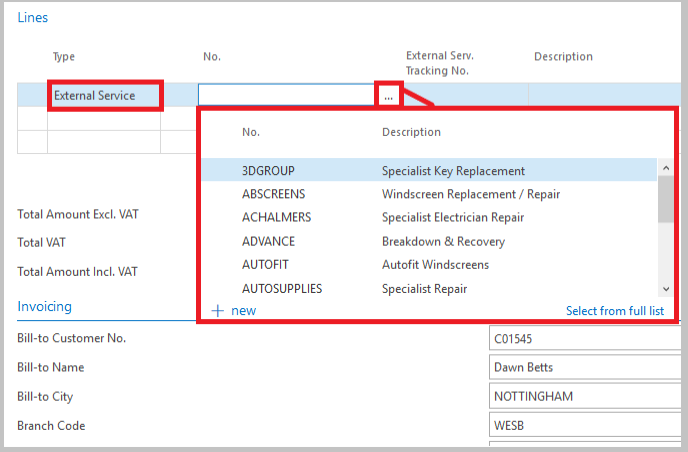
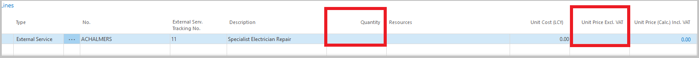

#   Create an External Service 

###  If you are receiving a service from an External Service Provider and the charge is to be passed on to your customer, you can charge this out by creating an ***External Service***. 

#####   Please follow the steps below on how to create an External Service. 

*   On the Jobsheet, within Lines, Select the type ***External Service***. 

    -   In No. either type the beginning of the Service Type or click on the ... and Select the Service Type. 

 

        This will pre-populate a line with your standard description for that particular External Service.

*   Then enter the quantity and value which you are charging. 

 

####   Unlike Parts, External Services can be invoiced out to a customer prior to receiving a purchase invoice. 

####    This is due to the fact you may not have received the invoice from the External Service Provider at the time you invoice the Jobsheet to the customer. 
