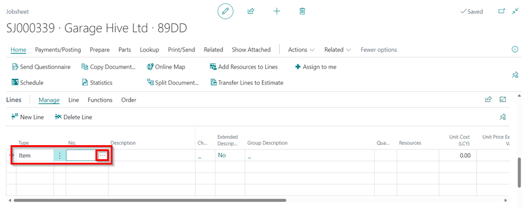

# Creating an External Service

If you are receiving a service from an external service provider and you want the charge to be passed on to your customer, you can charge this out by creating an **External Service**.

#

From the jobsheet lines under column **Type**, select **Item** from the dropdown menu and click on the Tab button to move to the next column, **No.**. Click on the arrow pointing down and select **+New** from the pop-up window. A list of several templates for new items will appear; scroll to **External Services** template and click on it. A new item card is created with **Item Category Code** as **External**. You can change the item **No.** and add the description of the external service. Click OK to create the external service item card and enter the quantity and value you are charging (see below). 

 

#
#

#

> **Note:** 
>
> Unlike Parts, External Services can be invoiced out to a customer before receiving a purchase invoice; this is because you may not have received the invoice from the External Service Provider when you invoice the Jobsheet to the customer. 
