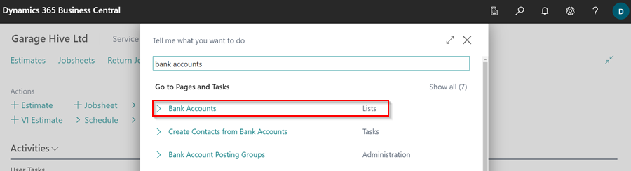
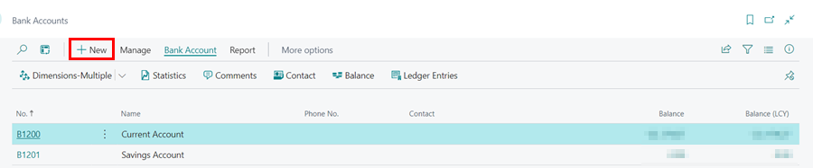

#   Create a new Bank Account 

Search for “chart of accounts”

By default, you should have 1200 – Bank Account and 1201 – Savings Account.

Click on new.

Choose the next sequential number and enter a name for your new bank account, set the rest up as below N.B. turn **OFF** direct posting as per the image below.

Next search for “bank accounts”

Select New.

Enter the number as "B" and the code you created in the chart of accounts e.g. B1202 and enter the accounts name, you can fill out the other details if you wish but it is not essential.

Scroll down to “Bank Acc. Posting Group” click the arrow on the right and select from full list.

Select New.

Enter a code (Name) that suits and select the corresponding nominal account that we created at the beginning, press ok.

Finally check the posting group selected is correct for the bank account.

**If you will be making payments directly in to or out of this account you may want to set up additional payment methods.**
