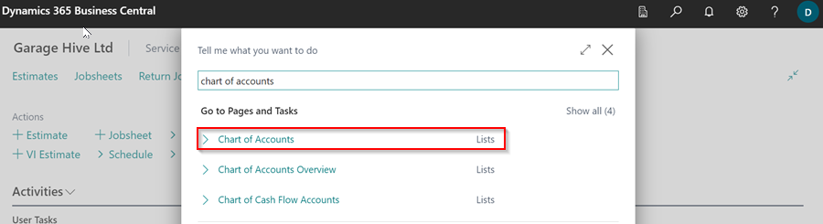
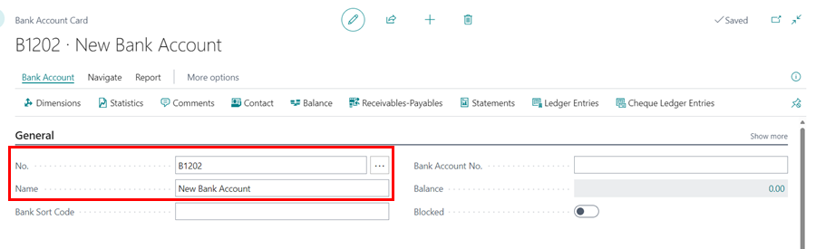
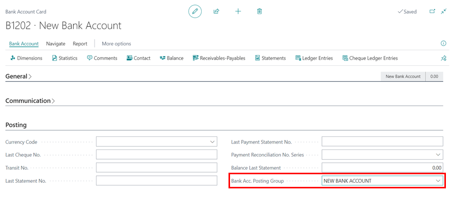

# How to create a Bank Account in Garage Hive
Creating a bank account in a Garage Hive is important because it allows you to keep track of all your financial transactions and ensures that your records are accurate and up to date in the system. This process should be done in consultation with your accountant for further guidance. Here's how to do it:

1. In the top right corner, choose the  icon, enter **Chart of Accounts**, and select the related link.

   

2. By default, your system should have the following bank accounts set up: 
   - **1200** – Bank Account
   - **1201** – Savings Account
3. Select **New** from the menu bar.

   

4. Enter the **No.** as the next sequential number from the previously created bank accounts, followed by the name of the new bank account. Set up the **General** FastTab as shown below. Take note that **Direct Posting** is disabled. Click the back arrow (&#8592;) to close the card after the setup.

   

5. The next step is to search for **Bank Accounts** in the top right corner search  icon, and select the related link.

   

6. Select **New** from the menu bar to add the newly created bank account.

   

7. Enter the **No.** of the bank account beginning with **"B"**, followed by the code you created in the chart of accounts, for example **B1202**, and the bank account name. You can fill out the remaining fields if you want, but it is not required.

   

8. Scroll down to the **Posting** FastTab, then click the down arrow (&#709;) in the **Bank Acc. Posting Group** field, then **select from the full list**. 

   

9. In the **Bank Account Posting Groups** page, select **New**, enter the name of the bank in the **Code** field, and use the code you created in the chart of accounts as the **G/L Account No.**. Click **OK**.

   

10. Confirm that the **Posting Group** selected is correct for the bank account. Click the back arrow (&#8592;) to close bank account card.

   

11. The bank account will now be created and ready for use.



[Go back to top](#top)

