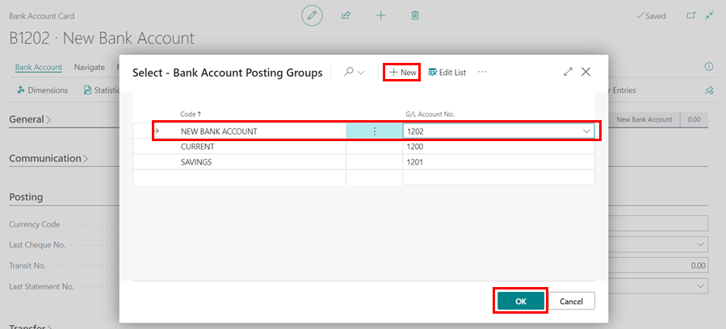

# How to create Bank Accounts and Import Bank Statements
Creating bank accounts and importing bank statements in Garage Hive is important when it comes to financial management because they help you improve tracking and controlling financial transactions in the system. This process should be done in consultation with your accountant for further guidance.

## In this article
1. [Creating a Bank Account](#creating-a-bank-account)
2. [Importing Bank Statements](#importing-bank-statements)

### Creating a Bank Account
1. In the top right corner, choose the  icon, enter **Chart of Accounts**, and select the related link.

   

1. By default, your system should have the following bank accounts set up: 
   - **1200** – Bank Account
   - **1201** – Savings Account
1. Select **New** from the menu bar.

   

1. Enter the **No.** as the next sequential number from the previously created bank accounts, followed by the name of the new bank account. Set up the **General** FastTab as shown below. Take note that **Direct Posting** is disabled. Click the back arrow (&#8592;) to close the card after the setup.

   

1. The next step is to search for **Bank Accounts** in the top right corner search  icon, and select the related link.

   

1. Select **New** from the menu bar to add the newly created bank account.

   

1. Enter the **No.** of the bank account beginning with **"B"**, followed by the code you created in the chart of accounts, for example **B1202**, and the bank account name. You can fill out the remaining fields if you want, but it is not required.

   

1. Scroll down to the **Posting** FastTab, then click the down arrow (&#709;) in the **Bank Acc. Posting Group** field, then **select from the full list**. 

   

1. In the **Bank Account Posting Groups** page, select **New**, enter the name of the bank in the **Code** field, and use the code you created in the chart of accounts as the **G/L Account No.**. Click the **OK**.

   

1. Confirm that the **Posting Group** selected is correct for the bank account. Click the back arrow (&#8592;) to close bank account card.

   

1. The bank account will now be created and ready for use.



### Importing Bank Statements
To import bank statements in Garage Hive:
1. In the top right corner, choose the  icon, enter **Bank Account Reconciliations**, and select the related link.

   

2. Select **New** from the menu bar.

   

3. In the **Bank Account No.** select the relevant bank account. The bank account ledger entries that exist on the bank account appear in the **Bank Account Ledger Entries** pane.
4. In the **Statement Date** field, enter the date of the statement from the bank.
5. In the **Balance Last Statement** field, enter the balance of the last statement used in the posted bank reconciliation for the selected bank account. If this is your first time importing the statement, leave this field blank.
6. In the **Statement Ending Balance** field, enter the balance of the statement from the bank.

   

7. Select **Bank** from the menu bar, followed by the **Import Bank Statement** action.

   

8. Locate the file, and then choose the Open button to import the bank transactions into the **Bank Statement Lines** pane on the **Bank Acc. Reconciliation** page.

   
