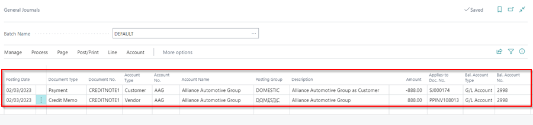

## How to Create Warranty Job



## Scenario
You purchased a clutch, fitted it in the customer's vehicle, charged the customer, and then the clutch failed. You must now replace the clutch, but you will not do so for free; your parts supplier will pay the bill. That is, you are doing a warranty job for the customer, but your parts supplier is paying the bill.

Here is the process for creating a warranty job:
1. Create a Jobsheet as normal, but at the bottom add the vendor's name as the **Bill-to Customer** and add the **Payment Terms Code**. Create a customer name from the vendor name to use.

   

2. Send the invoice to the supplier and make sure you agree on the amount for parts and labour. This is important because it will determine how much the supplier will do on the credit note.
3. After you've agreed on the amounts, have the supplier issue a credit note for the amount on the invoice you sent them. Of course, if there were any changes to be made, you have already made them and resent the invoice to the supplier.
4. The Front of House/Service Advisor will now post the Jobsheet **when the credit note is received and matches the amount on the Jobsheet**. If there are any discrepancies, follow-up with the supplier is required, and the Jobsheet **cannot** be posted until the credit note matches the amount on the Jobsheet.

   

5. The Front of House/Service Advisor will now send all documentation to the accounts department.

   

6. The Accounts department will now perform the **Customer/Vendor Balancing Payments (also known as Contra Payments)**. For this posting, the accounts will post the two journals as follows:   
      - **Line 1 - Customer:** choose **Document Type** as **Payment**, enter the Credit Note No. as the **Document No.**, select the customer as the name of the vendor billed in the Jobsheet, select **Applies-To-Doc-No.** as the vendor's Jobsheet posted for the vendor, enter a negative value in the **Amount** field and assign to **GL Account 2998** Suspense Account.
      - **Line 2 - Vendor:** choose **Document Type** as **Credit Memo**, enter the Credit Note No. as the **Document No.**, select the vendor name as the vendor you have received the credit note from, enter a positive value in the **Amount** field, select the **Applies-To-Doc-No.** as the purchase invoice that you received the items you fitted in the customer's vehicle and assign to **GL Account 2998**.

         
   
      Please read about the **Contra Payments** and how to do it [here](garagehive-contra-payment.html){:target="_blank"}.
7. Once you are done with the journal, select **Post/Print** from menu bar, and then **Post**.

      

[Go back to top](#top)
