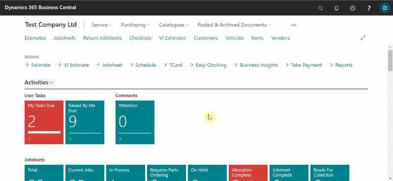

# Create Your First Booking

## Outline
1. [Create a booking](#create-a-booking)
2. [Add vehicle details](#add-vehicle-details)
3. [Add customer details](#add-customer-details)
4. [Add comments](#add-comments)

### Create a booking

To create a booking from the home page, click on  the **Schedule** from the actions bar, select the bay or the technician to allocate the booking, left click and drag horizontally on the right from the time the booking will start to the end of the booking, and then release. A pop-up window appears, select the type of allocation for the booking and click okay (see below).

### Add vehicle details
 
 After clicking okay, a jobsheet will be created and appear on the pop-up window. Start by typing in the vehicle registration number on the field **Vehicle Registration No.** and press the tab button, the vehicle details are added automatically (see below).

### Add customer details

If the vehicle was already added before, the customer details will be added automatically. If not, start typing the customer's name under the field **Customer** and press the tab button to create a new customer. From the pop-up window that appears, add the customer's address, by searching on *lookup address from postcode*, add customer's phone number and email address on the respective fields, scroll down to **Payments** section and add the payments terms. Scroll up to add a credit limit for the customer (if necessary) and then click close to create the customer's card (see below).

   
### Add comments

To add a comment, scroll down to the **Comments** section on the jobsheet, select a line and the type of comment you want to add, select the next cell under **Comment (Extended)**, and a pop-up window will appear. This is where you write your comment, you can maximize the window for a better view. After doing the comment, close the window to create the comment indicating the time and date created (see below).

> Note: The comment can be as long as you want it, no limit.

To watch a video on how to create a booking, [click here](https://www.youtube.com/watch?v=MJqFUQyV2Tc).