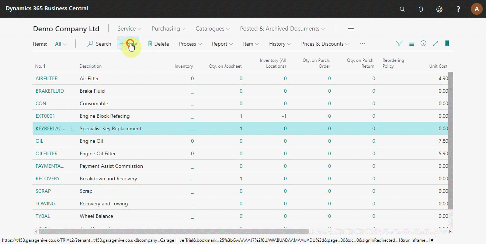
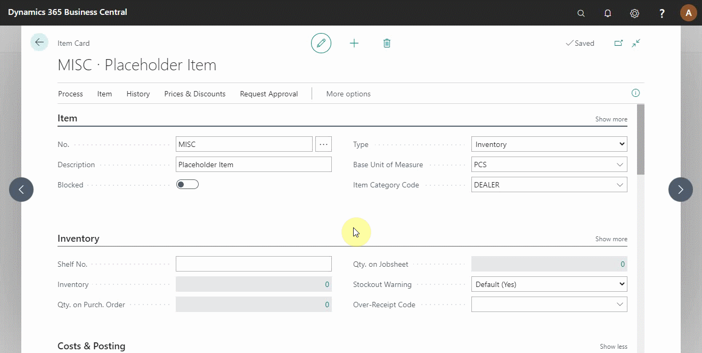
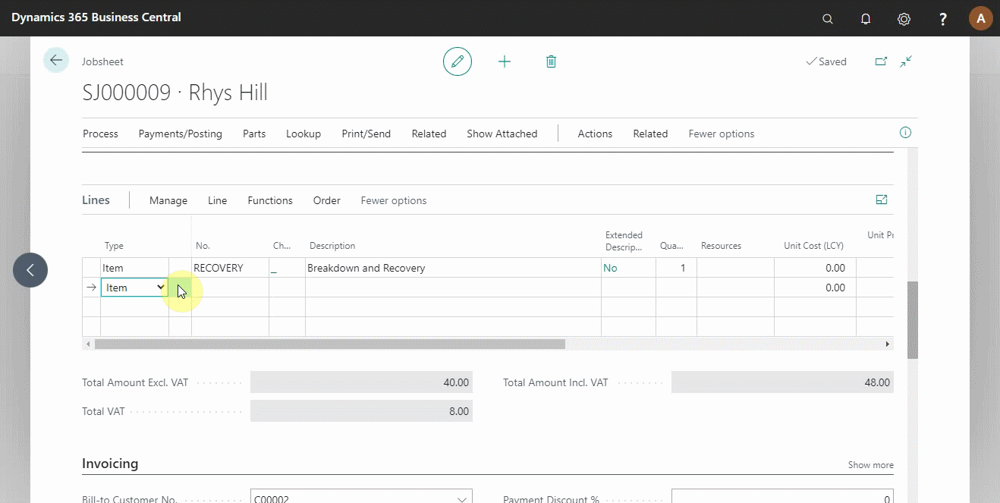
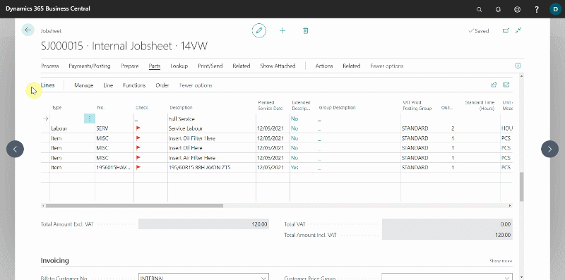

Placeholder Item is used when waiting on purchase invoice from the supplier; it enables you to add the items to the Estimates, Vehicle Inspection Estimates, Jobsheets, or Purchase Orders without the purchase invoice.

## In this article
1. [Creating a Placeholder Item](#creating-a-placeholder-item)
2. [Add Placeholder Item in a document](#add-placeholder-item-in-a-document)
3. [Convert Placeholder Item to Inventory Item](#convert-placeholder-item-to-inventory-item)

### Creating a Placeholder Item
To create a placeholder item:
1. click on **Items** from the navigation bar in the role centre.

    

2. Select **+New** from the items list page that opens.
3. Assign an **Item Template** and click OK. 
4. You can add an **Item No.** and **Description** according to your preference (in this case, the item no will be **MISC** and description **Placeholder Item**). 

    

5. Scroll down to the **Costs and Posting** section and select the slider on **Placeholder Item**.
6. If you can't see the option, click on **Show More** at the top-right corner of the section.

### Add Placeholder Item in a document
After creating a placeholder item, you can add it to a document for items you are yet to receive a purchase invoice. To add it in a jobsheet:
1. Open the particular jobsheet and select **Item** from the **Type** column in the jobsheet lines. 
2. Start typing the placeholder item name in the **No.** column and choose it from the options. 
3. Add a description and unit price. 
4. You can as well [Create a Purchase Order for the Item from the Jobsheet](garagehive-create-a-purchase-order.html).



### Convert Placeholder Item to Inventory Item
When you receive the purchase invoice from the supplier, convert the placeholder item to the item on the purchase invoice. To do this from the **Purchase Order**:
1. Open the **Purchase Order**
1. Open the Jobsheet with the placeholder items, select **Parts** followed by **Convert Placeholder Items** from the actions bar.
2. Scroll right to the **Action** column, and click on **Select Item**. Select the item from the **Items** List, and click **OK**.
3. Repeat step **2** for all placeholder items.

   


