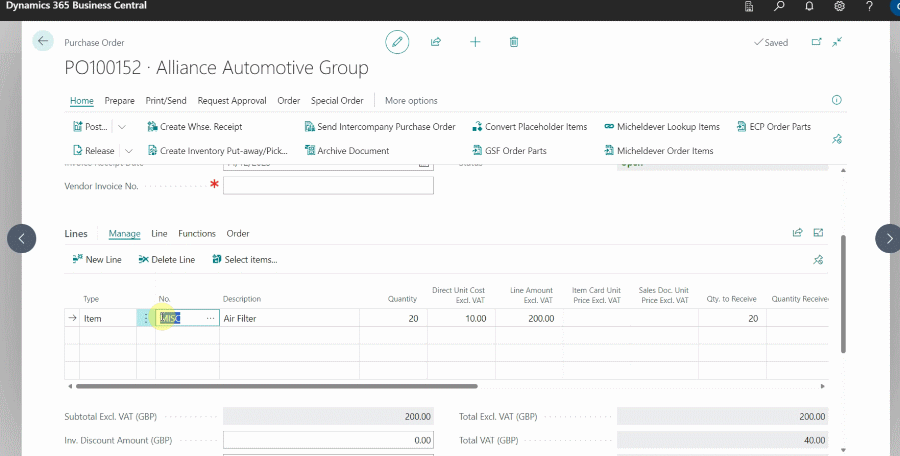

## Working with a Placeholder Item
Placeholder Item is used when waiting on purchase invoice from the supplier; it enables you to add the items to the Estimates, Vehicle Inspection Estimates, Jobsheets, or Purchase Orders without the supplier's purchase invoice.

## In this article
1. [Creating a Placeholder Item](#creating-a-placeholder-item)
2. [Add Placeholder Item in a document](#add-placeholder-item-in-a-document)
3. [Convert a Placeholder Item into an inventory item](#convert-a-placeholder-item-into-an-inventory-item)
4. [Convert a Placeholder Item to the Vendor Item Number](#convert-a-placeholder-item-to-the-vendor-item-number)

### Creating a Placeholder Item
To create a placeholder item:
1. click on **Items** from the navigation bar in the Role Centre.

    

2. Select **New** from the items list page that opens.

   

3. Assign an **Item Template** and click **OK**.

   

4. Add an **Item No.** and **Description** according to your preference (in this case, the Item No. will be **MISC** and description **Placeholder Item**). 

    

5. Scroll down to the **Costs and Posting** FastTab and select the slider on **Placeholder Item** field.
6. If you can't see the option, click on **Show More** at the top-right corner of the section.

[Go back to top](#top)

### Add Placeholder Item in a document
Once you create a placeholder item, you can add it to a document (Can be Jobsheet, Estimate or Vehicle Inspection Estimate) for items that you haven't received a purchase invoice for yet. To add it in a Jobsheet:
1. Open the particular Jobsheet and select **Item** from the **Type** column in the Jobsheet lines. 
2. Type the placeholder item name in the **No.** column and press the tab key. 
3. Add a description and unit price; do not rename the placeholder item.

   

   

4. You can as well [Create a Purchase Order for the Item from the Jobsheet](garagehive-create-a-purchase-order.html){:target="_blank"}.

[Go back to top](#top)

### Convert a Placeholder Item into an inventory item
When you receive the Purchase Invoice from the supplier, convert the placeholder item to the item on the Purchase Invoice. To do this from the **Purchase Order**:
1. Open the **Purchase Order** and replace the placeholder item **No** with the actual item **No.** from the vendor's purchase invoice.
2. Select **Create a new item card for (Item No.)** in the pop-up window and click **OK**.
3. On the next page, choose a template for the new item and click **OK**. The placeholder item **No.** will be replaced, but the description will stay.

   

[Go back to top](#top)

### Convert a Placeholder Item to the Vendor Item Number
Use this method when the **Vendor Item No.** field is prefilled using the external integration available in Garage Hive. To do this from the Purchase Order:
1. Open the **Purchase Order** and select **Home**, then **Convert Placeholder Items** from the menu bar.

   

2. Scroll to the right to the **Action** column, and for each item, click the **Create Item** action and select the template on the page that appears.
3. When you're done with all of the items, click **OK**.

   

To convert the items in the **Jobsheet**:
1. Open the Jobsheet with the placeholder items, select **Parts** followed by **Convert Placeholder Items** from the menu bar.

   

2. Scroll right to the **Action** column, and click on **Select Item**. Select the item from the **Items** List, and click **OK**.

   

3. Repeat step **2** for all placeholder items.



[Go back to top](#top)