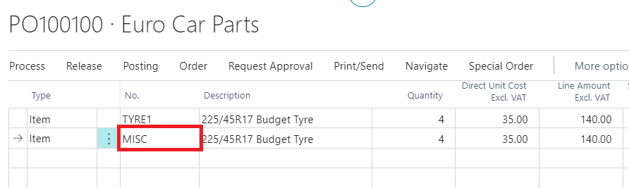

# Creating a Purchase Order

To start communicating with the suppliers/vendors, you need to prepare the purchase orders, which indicate the items you require. The purchase orders can be prepared directly from the purchase order page or the jobsheet. Let’s look at the different methods.

## In this article

1. [Creating the purchase order from the purchase order page](#creating-the-purchase-order-from-the-purchase-order-page)
2. [Linking a purchase order with the jobsheet](#linking-a-purchase-order-with-the-jobsheet)
3. [Creating a purchase order from the jobsheet](#creating-a-purchase-order-from-the-jobsheet) 

### Creating the purchase order from the purchase order page
From the navigation menu on the role centre, click on **Purchasing** to access the submenus and select **Purchase Orders**. The purchase orders page opens; click on **+New** to create a new purchase order and enter the vendor details from the **General** fast tab (see below).

After adding the vendor details, add the item(s) to order at the purchase order **Lines**, specifying the item **No.**, **Quantity** and **Description**. For the non-stock items, you can use **Misc** for the item **No.** (See Below).

 

### Linking a purchase order with the jobsheet
To assign the items received to a jobsheet, from the **General** fast tab, fill in the **Jobsheet No.** or choose from the list. After linking with the jobsheet, it ensures that the items won't be signed out to another jobsheet since they are already in one.

> **Note**
> 
> You can only link a purchase order to a jobsheet once you receive the supplier invoice.

### Creating a purchase order from the jobsheet
To create a purchase order from the jobsheet, select the item line you want to order, tick on the box in column **Purchase(Special)**; this selects the items you want to order and to add in the purchase order. Add the vendor to order from on the **Vendor No.** column. Click on **Parts** from the action bar, select **Create Purchase Order(s)** from the submenu, and a purchase order is created (see below).

### **See Also**

[Video: How to create a purchase order](https://www.youtube.com/watch?v=M1KB7dSiZrY).