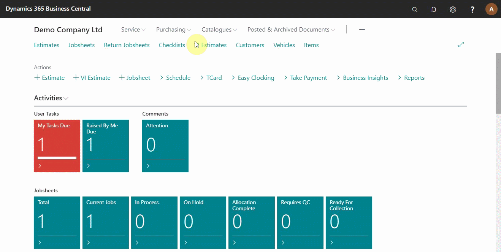
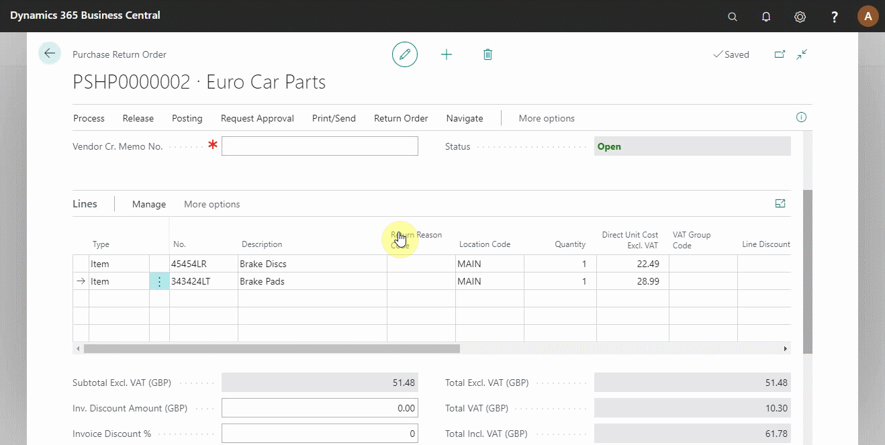
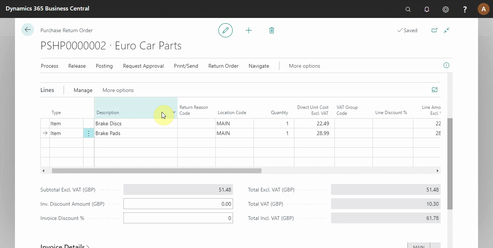

# Creating a Purchase Return Order

A purchase return order are documents you use to monitor and maintain all your returns. They help you track the shipping back of items and receiving the credit memo when processed by the supplier.

## In this article

1. [Creating a purchase return order](#creating-a-purchase-return-order)
2. [Shipping the items to the supplier](#shipping-the-items-to-the-supplier)
3. [Posting a credit memo from the supplier](#posting-a-credit-memo-from-the-supplier)

### Creating a purchase return order
From the role centre, click on **Purchasing** and select **Purchase Return Orders**. Click on **+New** to create a new purchase return order. Enter the vendor details and the items to return (see below).

### Shipping the items to the supplier
When the purchase return order is created, the items must be returned to the supplier for credit memo processing. Click **Posting** from the action bar and select **Post** from the submenus to do this from the system. The pop-up menu gives you three options to choose from, select **Ship** as you wait for the supplier credit memo (see below).

 

### Posting a credit memo from the supplier
After receiving a credit memo from the supplier, ensure that all the details on the credit memo match the purchase return order; the date, document number, and the amounts. Click on **Posting** from the action bar and select **Post** from the submenus. Now select **Invoice** from the three options, updating the relevant ledger accounts and balancing the stock levels.

### **See Also**

[Video: How to create a purchase return order](https://www.youtube.com/watch?v=X81T5UAOTNU&t=83s).