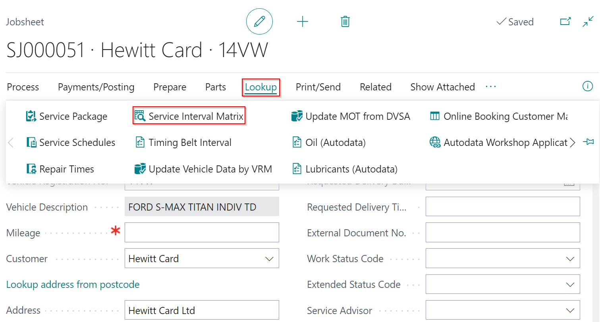
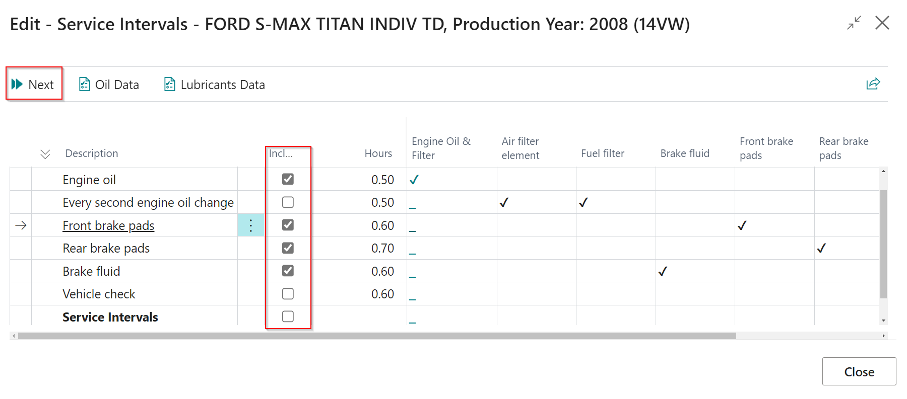
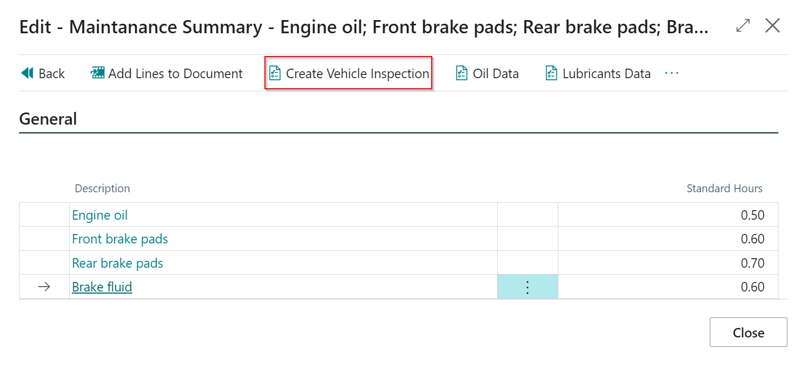
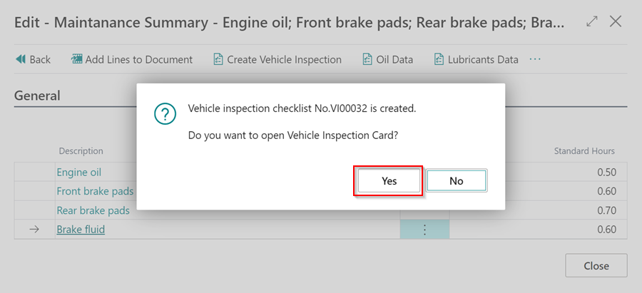
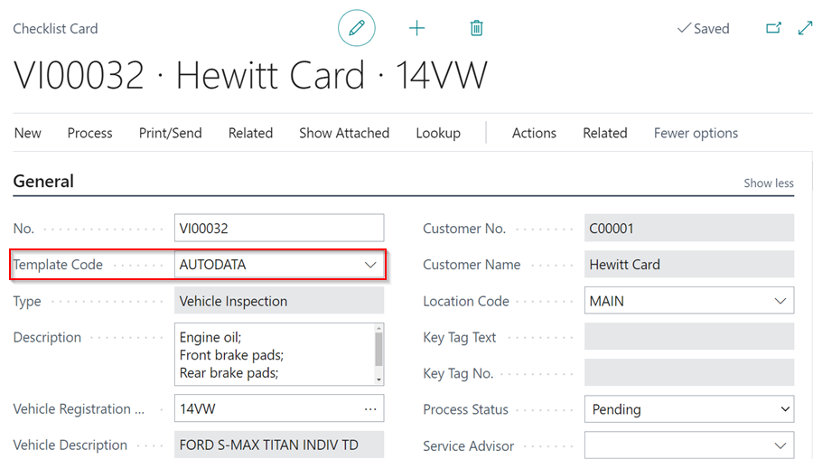
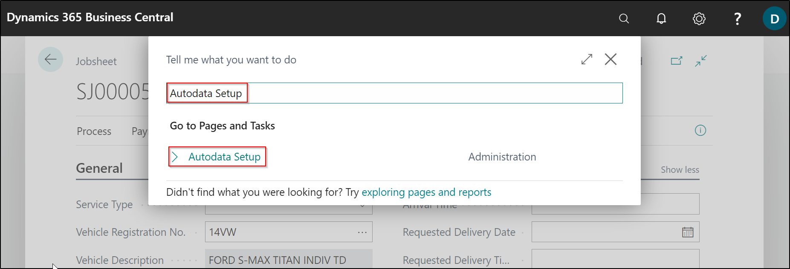
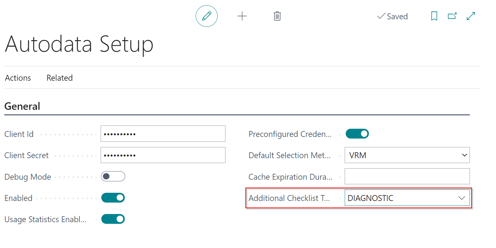

## In this article
1. [Creating a Vehicle Inspection Checklist from Autodata](#creating-a-vehicle-inspection-checklist-from-autodata)
2. [Add Custom Checklist Templates at the bottom of Autodata Checklists](#add-custom-checklist-templates-at-the-bottom-of-autodata-checklists)

### Creating a Vehicle Inspection Checklist from Autodata
When using the Autodata **Service Interval Matrix**, you may create a Vehicle Inspection Checklist with the data from Autodata, allowing you to generate a quotation for the customer.
1. Select **Lookup** from the menu bar of the document you're working on, then **Service Interval Matrix**. In the pop-up notification, click **Yes**.

   

2. If the vehicle registration is not auto-detected, select **Other**, and click **OK** to choose the **Make** and **Model** of the vehicle from Autodata.

   
   
3. In the **Service Intervals** page, check the **Include** checkbox next to the **Service Times** and **Service Intervals** you want to include. 
4. From the menu bar, select **Next**.

   

5. Select **Create Vehicle Inspection** from the menu bar on the page that opens.

   

6. There will be a **Vehicle Inspection** Checklist created, with the template **AutoData**. To open it, click **Yes** on the pop-up notification.

   

   

[Go back to top](#top)

### Add Custom Checklist Templates at the bottom of Autodata Checklists.
1. When you want to add an additional Checklist template for each Checklist you create, in the top right corner, choose the  icon, enter **Autodata Setup** and select the related link.

   

2. Go to the **Additional Checklist Templ. Code** field and choose the template to use for all Autodata checklists. Close the **Autodata Setup** page.

   

3. If you now create a Checklist from Autodata, it will include the additional template checklist alongside the one from Autodata.

[Go back to top](#top)
