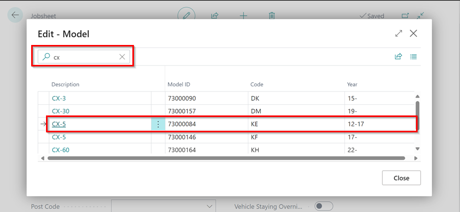

## In this article
1. [Creating a Vehicle Inspection Checklist from Autodata through Auto Selection of Vehicle](#creating-a-vehicle-inspection-checklist-from-autodata-through-auto-selection-of-vehicle)
2. [Creating a Vehicle Inspection Checklist from Autodata through Manual Selection of Vehicle](#creating-a-vehicle-inspection-checklist-from-autodata-through-manual-selection-of-vehicle)
3. [Add Custom Checklist Templates at the bottom of Autodata Checklists](#add-custom-checklist-templates-at-the-bottom-of-autodata-checklists)

### Creating a Vehicle Inspection Checklist from Autodata through Auto Selection of Vehicle
When using the Autodata **Service Interval Matrix**, you may create a Vehicle Inspection Checklist with the data from Autodata, allowing you to generate a quotation for the customer.
1. Select **Lookup** from the menu bar of the document you're working on, then **Service Interval Matrix**. In the pop-up notification, click **Yes**.

   

2. When the pop-up window opens, confirm the vehicle details by clicking **Yes**. If the details don't match, click **No** and select the correct vehicle.

   
   
2. In the **Service Intervals** page, check the **Include** checkbox next to the **Service Times** and **Service Intervals** you want to include. 
3. From the menu bar, select **Next**.

   

4. Select **Create Vehicle Inspection** from the menu bar on the page that opens.

   

5. There will be a **Vehicle Inspection** Checklist created, with the template **AutoData**.

   

6. To open it, click **Yes** on the pop-up notification.

   

[Go back to top](#top)

### Creating a Vehicle Inspection Checklist from Autodata through Manual Selection of Vehicle
Manual selection can be used to get data from Autodata for any vehicle and is not specific to any market. To view and add the data using manual selection:
1. If the vehicle registration is not automatically detected, a pop-up window will appear. Select **Other** and then click **OK** to choose the vehicle make and model from Autodata.

   

2. In the window that opens, search for the **Model** of the vehicle and click on the **Description** to select it.

   

3. After that, you should select the **Vehicle Type** based on the **Engine Code** of the vehicle in the next window that opens.

   

4. Then, select the appropriate option for the vehicle.

   

5. Finally, follow the steps from step number 3 in the [auto selection part](#creating-a-vehicle-inspection-checklist-from-autodata-through-auto-selection-of-vehicle) to complete the process.

[Go back to top](#top)

### Add Custom Checklist Templates at the bottom of Autodata Checklists.
1. When you want to add an additional Checklist template for each Checklist you create, in the top right corner, choose the  icon, enter **Autodata Setup** and select the related link.

   

2. Go to the **Additional Checklist Templ. Code** field and choose the template to use for all Autodata checklists. Close the **Autodata Setup** page.

   

3. If you now create a Checklist from Autodata, it will include the additional template checklist alongside the one from Autodata.

[Go back to top](#top)
