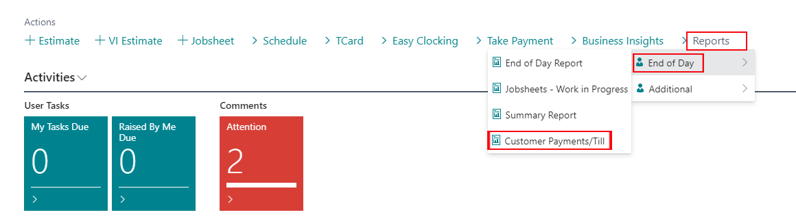
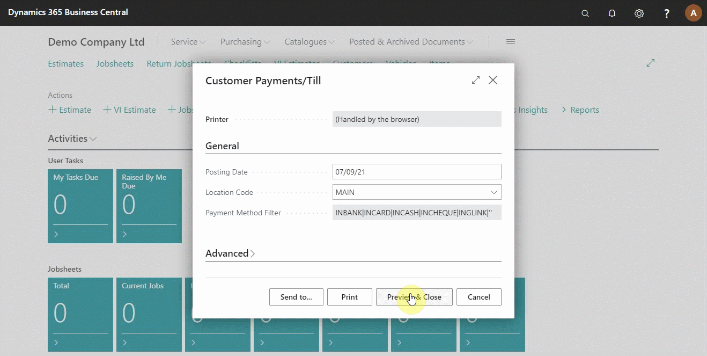

# Creating End of Day Customer Payments/Till Report

End of day customer payments/till report summarises the amount of money collected from each customer and the total amount collected for the day; this helps you as a business owner know the cash inflow to the business for the day.

#

To create the report, click on **Reports** from the actions bar in the role centre, point the cursor to **End of Day** submenu, and click on **Customer Payments/Till**.

From the pop up window that appears, click on **Preview & Close** to preview the report (see below).

