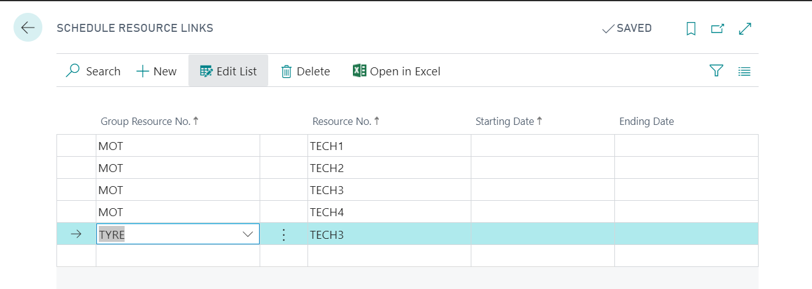
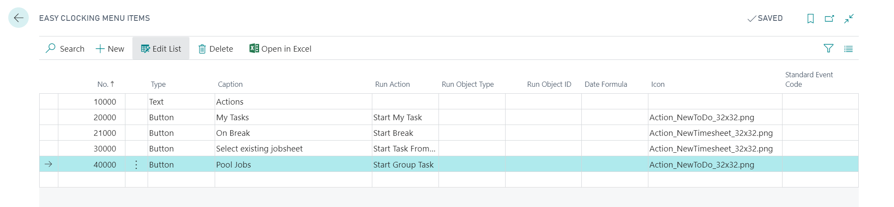
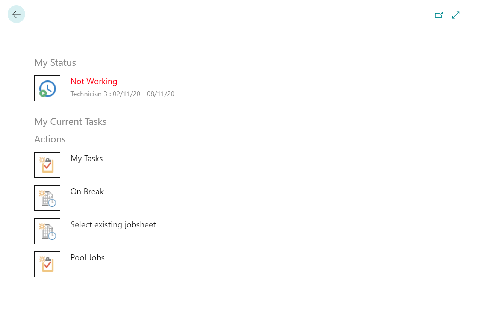

#   Creating Pool Jobs 

The pool job feature allows you to offer jobs schedule allocations that are spread across multiple resources to a technician. 

First set up the resource links, Search for Schedule resource links.
In this example we are setting it up so all the techs can see the MOT bay and Tech 3 can see the MOT bay and the TYRE bay.

---

---

Then search for Easy clocking menu items.

---

---

Set this table up as shown above, you can reorder the actions using the No. Column and the icons can only be one of the two image files mentioned in the icon column.

That's it! now if you check Easy Clocking you will see the new icon.

---

---